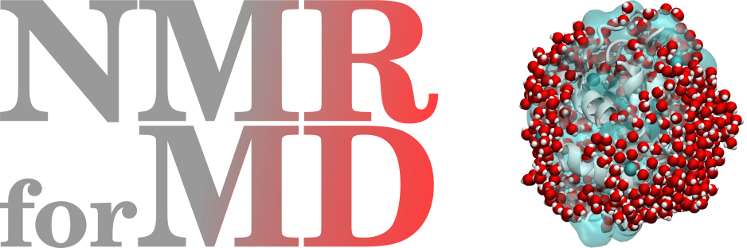
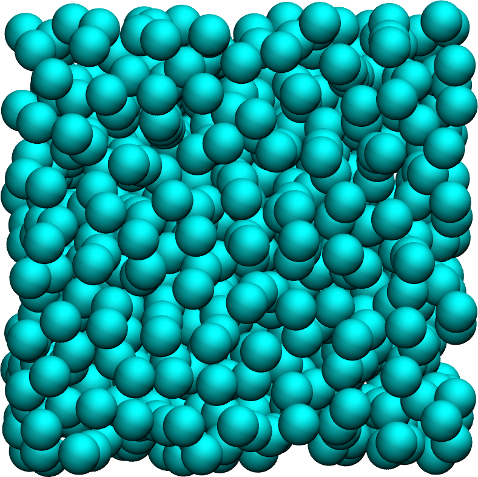
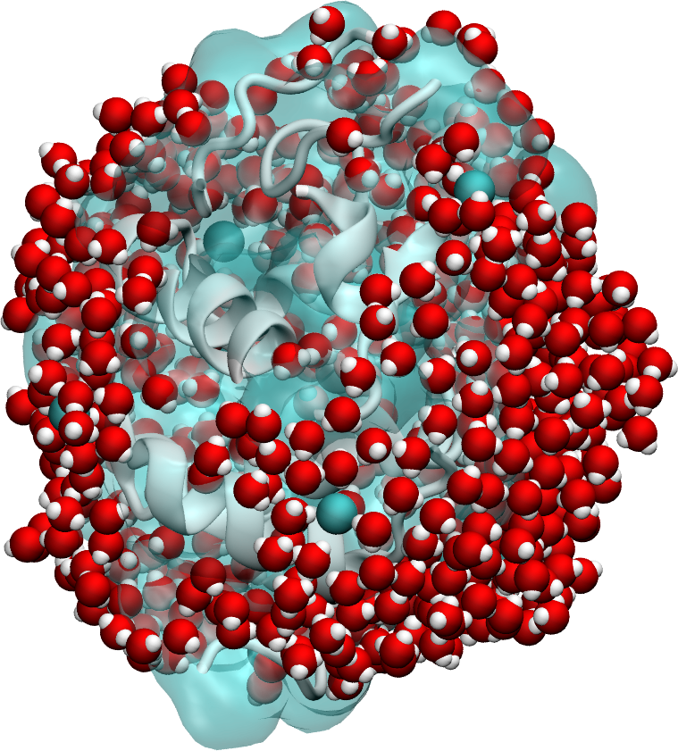

# NMRforMD

<a href="webp">
  
</a>

Dipolar Nuclear Magnetic Resonance for Molecular Dynamics
(NMRforMD or formerly NMRforMD) simulations
is a Python toolkit designed for the computation of
dipolar NMR relaxation times (the so called $T_1$ and $T_2$)
from molecular dynamics simulations.
Used in combination with [MDAnalysis](https://www.mdanalysis.org/),
NMRforMD allows for the analysis of trajectory
files from any MDAnalysis-compatible simulation package, including
[LAMMPS](https://www.lammps.org/) and [GROMACS](https://www.gromacs.org/).

## Documentation

Details about installation and use of NMRforMD
are given in the [documentation](https://nmrformd.readthedocs.io/en/latest/).
The documentation also contains a description of
the theory behind dipolar dipolar NMR calculations, as well as
a explanation of some common pitfalls of NMR calculations.

<p float="left">
    <a href="https://nmrformd.readthedocs.io/en/latest/">
        
    </a>
    <a href="https://nmrformd.readthedocs.io/en/latest/">
        
    </a>
    <a href="https://nmrformd.readthedocs.io/en/latest/">
        
    </a>
</p>

## Warning

The code has mostly been tested in the case of 1H-NMR (i.e. spin 1/2).
It is also important to keep in mind that NMRforMD only works for
dipolar interaction, not quadrupolar interaction.

## Known issues

For very large trajectory file, the code requires a lot of memory.
The code is not adapted to triclinic box, convert your trajectory
to orthorhombic prior to calculation. This code is still in development,
please raise an issue here if you encounter another problem.

## For developers

If you intend to make modification to the code, please raise an issue or send me an email
first. Then, fork the repository, apply your changes, then make a pull request
that will be reviewed.

Close the repository as follow (use the --recurse-submodule
option only if you want to clone the data as well):

``` bash
   git clone https://github.com/simongravelle/nmrformd.git --recurse-submodule
```

Build the documentation locally from the [docs](docs/) folder by typing:

``` bash
    pip3 install -r requirements.txt
    make clean
    make html
```

Publish a new pip version by following those
[instructions](https://gist.github.com/arsho/fc651bfadd8a0f42be72156fd21bd8a9).

1 - if necessary, update *docs/source/conf.py*, *CITATION.cff*, and *setup.py*

2 - Create source distribution using

``` bash
    python3 setup.py sdist
```

3 - Create a new release on Github using the generated tar.gz file located in dist/

4 - Update the link in setup.py

5 - Create wheel using:

``` bash
    python3 setup.py bdist_wheel
```

6 - Upload to pypi using (with the appropriate number):

``` bash
    twine upload dist/nmrformd-0.1.0*
```

![Powered by MDAnalysis](https://img.shields.io/badge/powered%20by-MDAnalysis-orange.svg?logoWidth=16&logo=data:image/x-icon;base64,AAABAAEAEBAAAAEAIAAoBAAAFgAAACgAAAAQAAAAIAAAAAEAIAAAAAAAAAAAAAAAAAAAAAAAAAAAAAAAAAAAAAAAAJD+XwCY/fEAkf3uAJf97wGT/a+HfHaoiIWE7n9/f+6Hh4fvgICAjwAAAAAAAAAAAAAAAAAAAAAAAAAAAAAAAACT/yYAlP//AJ///wCg//8JjvOchXly1oaGhv+Ghob/j4+P/39/f3IAAAAAAAAAAAAAAAAAAAAAAAAAAAAAAAAAAAAAAJH8aQCY/8wAkv2kfY+elJ6al/yVlZX7iIiI8H9/f7h/f38UAAAAAAAAAAAAAAAAAAAAAAAAAAB/f38egYF/noqAebF8gYaagnx3oFpUUtZpaWr/WFhY8zo6OmT///8BAAAAAAAAAAAAAAAAAAAAAAAAAAAAAAAAgICAn46Ojv+Hh4b/jouJ/4iGhfcAAADnAAAA/wAAAP8AAADIAAAAAwCj/zIAnf2VAJD/PAAAAAAAAAAAAAAAAICAgNGHh4f/gICA/4SEhP+Xl5f/AwMD/wAAAP8AAAD/AAAA/wAAAB8Aov9/ALr//wCS/Z0AAAAAAAAAAAAAAACBgYGOjo6O/4mJif+Pj4//iYmJ/wAAAOAAAAD+AAAA/wAAAP8AAABhAP7+FgCi/38Axf4fAAAAAAAAAAAAAAAAiIiID4GBgYKCgoKogoB+fYSEgZhgYGDZXl5e/m9vb/9ISEjpEBAQxw8AAFQAAAAAAAAANQAAADcAAAAAAAAAAAAAAAAAAAAAAAAAAAAAAAAAAAAAjo6Mb5iYmP+cnJz/jY2N95CQkO4pKSn/AAAA7gAAAP0AAAD7AAAAhgAAAAEAAAAAAAAAAACL/gsAkv2uAJX/QQAAAAB9fX3egoKC/4CAgP+NjY3/c3Nz+wAAAP8AAAD/AAAA/wAAAPUAAAAcAAAAAAAAAAAAnP4NAJL9rgCR/0YAAAAAfX19w4ODg/98fHz/i4uL/4qKivwAAAD/AAAA/wAAAP8AAAD1AAAAGwAAAAAAAAAAAAAAAAAAAAAAAAAAAAAAALGxsVyqqqr/mpqa/6mpqf9KSUn/AAAA5QAAAPkAAAD5AAAAhQAAAAEAAAAAAAAAAAAAAAAAAAAAAAAAAAAAADkUFBSuZ2dn/3V1df8uLi7bAAAATgBGfyQAAAA2AAAAMwAAAAAAAAAAAAAAAAAAAAAAAAAAAAAAAAAAAB0AAADoAAAA/wAAAP8AAAD/AAAAWgC3/2AAnv3eAJ/+dgAAAAAAAAAAAAAAAAAAAAAAAAAAAAAAAAAAAAAAAAA9AAAA/wAAAP8AAAD/AAAA/wAKDzEAnP3WAKn//wCS/OgAf/8MAAAAAAAAAAAAAAAAAAAAAAAAAAAAAAAAAAAAIQAAANwAAADtAAAA7QAAAMAAABUMAJn9gwCe/e0Aj/2LAP//AQAAAAAAAAAA)


## Acknowledgments

This project has received funding from the European
Union's Horizon 2020 research and innovation programme
under the Marie Skłodowska-Curie grant agreement No 101065060.


