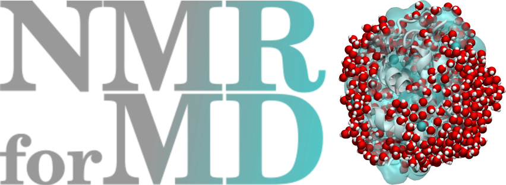
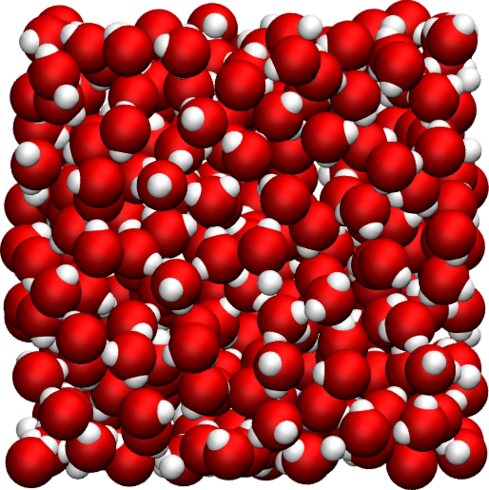

# NMRforMD

<a href="webp">
  
</a>

Dipolar Nuclear Magnetic Resonance for Molecular Dynamics
(NMRforMD) simulations
is a Python toolkit designed for the computation of
dipolar NMR relaxation times (the so called $T_1$ and $T_2$)
from molecular dynamics simulations.
Used in combination with [MDAnalysis](https://www.mdanalysis.org/),
NMRforMD allows for the analysis of trajectory
files from any MDAnalysis-compatible simulation package, including
[LAMMPS](https://www.lammps.org/) and [GROMACS](https://www.gromacs.org/).

## Documentation

Details about installation and use of NMRforMD
are given in the [documentation](https://nmrformd.readthedocs.io/en/latest/).
The documentation also contains a description of
the theory behind dipolar dipolar NMR calculations, as well as
details on some common pitfalls of NMR calculations.

<p float="left">
    <a href="https://nmrformd.readthedocs.io/en/latest/">
        
    </a>
    <a href="https://nmrformd.readthedocs.io/en/latest/">
        
    </a>
    <a href="https://nmrformd.readthedocs.io/en/latest/">
        
    </a>
</p>

Figure: Examples of systems that can be analyzed using NMRforMD,
from left to right: a bulk water system, a lennard-jones fluid,
and a lysozyme in water.

## Datasets

Two molecular dynamics datasets are available on Github. One 
is a [polymer in water](https://github.com/simongravelle/polymer-in-water.git) system generated using LAMMPS, 
the second is a [water confined in silica](https://github.com/simongravelle/water-in-silica.git)
generated using GROMACS. Both datasets are required to follow the tutorials
provided in the [documentation](https://nmrformd.readthedocs.io/en/latest/).

## Warning

The code has mostly been tested in the case of 1H-NMR (i.e. spin 1/2).
It is also important to keep in mind that NMRforMD only works for
dipolar interaction, not quadrupolar interaction.

## Known issues

For very large trajectory file, the code requires a lot of memory.
The code is not adapted to triclinic box, convert your trajectory
to orthorhombic prior to calculation. This code is still in development,
please raise an issue here if you encounter another problem.

## For developers

If you intend to make modification to the code, please raise an issue or send me an email
first. Then, fork the repository, apply your changes, then make a pull request
that will be reviewed.

Clone the repository as follow:

``` bash
git clone https://github.com/simongravelle/nmrformd.git --recurse-submodule
```

Find more instructions [here](developers/README.md).

## Acknowledgments

This project has received funding from the European
Union's Horizon 2020 research and innovation programme
under the Marie Skłodowska-Curie grant agreement No 101065060.


