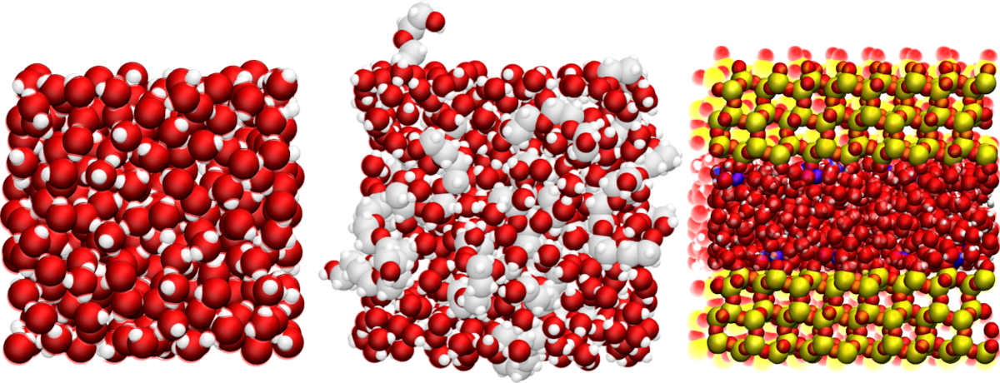

.. inclusion-readme-intro-start

Dipolar Nuclear Magnetic Resonance from Molecular Dynamics (DNMRfromMD) simulations
is a Python toolkit designed for the computation of 
dipolar NMR relaxation times (:math:`T1`` and :math:`T2`) from molecular dynamics simulations.
Used in combination with |MDAnalysis|, it allows for the analysis of trajectory
files from any MDAnalysis-compatible simulation package, including
|LAMMPS| and |GROMACS|.

.. |MDAnalysis| raw:: html

   <a href="https://www.mdanalysis.org/" target="_blank">MDAnalysis</a>

.. |LAMMPS| raw:: html

   <a href="https://www.lammps.org/" target="_blank">LAMMPS</a>

.. |GROMACS| raw:: html

   <a href="https://www.gromacs.org/" target="_blank">GROMACS</a>

.. inclusion-readme-intro-end

Details about installation, use, and some of the common pitfalls of NMR calculations
are given in the |documentation|. The documentation also contains a description of
the theory behind dipolar H-NMR calculations.

Notes and known issues
----------------------

- this code is still in development, please raise an issue here if you encounter a problem
- the code has mostly been tested with GROMACS and LAMMPS trajectory files, but should work with other molecular dynamics packages, as long as they are compatible with MDAnalysis
- the code is not adapted to triclinic box, convert your trajectory to orthorhombic prior to calculation
- for very large trajectory file, the code requires a lot of memory
- the code has mostly been tested in the case of 1H-NMR (i.e. spin 1/2)
- NMRforMD only works for dipolar interaction, not quadrupolar interaction

Figure : Examples of systems that can be analyzed using NMRforMD, from left to right: a 
bulk water system, a polymer-water mixture, and water in a slit silica nanopore with
sodium counter-ions. All LAMMPS and GROMACS input scripts are given in
the `examples/`_ folder. 

|mdanalysis| |readthedoc|

For developers
--------------

If you intend to make modification, please raise an issue or send me an email
first. Then, fork the repository, apply your changes, then make a pull request 
that will be review.

Build the documentation locally from the `docs/`_ folder by typing:

.. code-block:: bash 

    pip3 install -r requirements.txt
    make clean
    make html

Publish a new pip version by following those |instructions|.

1 - if necessary, update *docs/source/conf.py*, *CITATION.cff*, and *setup.py*

2 - Create source distribution using

.. code-block:: bash 

    python3 setup.py sdist

3 - Create a new release on Github using the generated tar.gz file located in dist/

4 - Update the link in setup.py

5 - Create wheel using:

.. code-block:: bash 

    python3 setup.py bdist_wheel

6 - Upload to pypi using (with the appropriate number):

.. code-block:: bash 
    
    twine upload dist/nmrformd-0.1.0*

.. _`docs/`: docs/
.. _`examples/`: examples/

.. |instructions| raw:: html

   <a href="https://gist.github.com/arsho/fc651bfadd8a0f42be72156fd21bd8a9" target="_blank">instructions</a>

.. |documentation| raw:: html

   <a href="https://nmrformd.readthedocs.io/en/latest/" target="_blank">documentation</a>

.. |mdanalysis| image:: https://img.shields.io/badge/powered%20by-MDAnalysis-orange.svg?logoWidth=16&logo=data:image/x-icon;base64,AAABAAEAEBAAAAEAIAAoBAAAFgAAACgAAAAQAAAAIAAAAAEAIAAAAAAAAAAAAAAAAAAAAAAAAAAAAAAAAAAAAAAAAJD+XwCY/fEAkf3uAJf97wGT/a+HfHaoiIWE7n9/f+6Hh4fvgICAjwAAAAAAAAAAAAAAAAAAAAAAAAAAAAAAAACT/yYAlP//AJ///wCg//8JjvOchXly1oaGhv+Ghob/j4+P/39/f3IAAAAAAAAAAAAAAAAAAAAAAAAAAAAAAAAAAAAAAJH8aQCY/8wAkv2kfY+elJ6al/yVlZX7iIiI8H9/f7h/f38UAAAAAAAAAAAAAAAAAAAAAAAAAAB/f38egYF/noqAebF8gYaagnx3oFpUUtZpaWr/WFhY8zo6OmT///8BAAAAAAAAAAAAAAAAAAAAAAAAAAAAAAAAgICAn46Ojv+Hh4b/jouJ/4iGhfcAAADnAAAA/wAAAP8AAADIAAAAAwCj/zIAnf2VAJD/PAAAAAAAAAAAAAAAAICAgNGHh4f/gICA/4SEhP+Xl5f/AwMD/wAAAP8AAAD/AAAA/wAAAB8Aov9/ALr//wCS/Z0AAAAAAAAAAAAAAACBgYGOjo6O/4mJif+Pj4//iYmJ/wAAAOAAAAD+AAAA/wAAAP8AAABhAP7+FgCi/38Axf4fAAAAAAAAAAAAAAAAiIiID4GBgYKCgoKogoB+fYSEgZhgYGDZXl5e/m9vb/9ISEjpEBAQxw8AAFQAAAAAAAAANQAAADcAAAAAAAAAAAAAAAAAAAAAAAAAAAAAAAAAAAAAjo6Mb5iYmP+cnJz/jY2N95CQkO4pKSn/AAAA7gAAAP0AAAD7AAAAhgAAAAEAAAAAAAAAAACL/gsAkv2uAJX/QQAAAAB9fX3egoKC/4CAgP+NjY3/c3Nz+wAAAP8AAAD/AAAA/wAAAPUAAAAcAAAAAAAAAAAAnP4NAJL9rgCR/0YAAAAAfX19w4ODg/98fHz/i4uL/4qKivwAAAD/AAAA/wAAAP8AAAD1AAAAGwAAAAAAAAAAAAAAAAAAAAAAAAAAAAAAALGxsVyqqqr/mpqa/6mpqf9KSUn/AAAA5QAAAPkAAAD5AAAAhQAAAAEAAAAAAAAAAAAAAAAAAAAAAAAAAAAAADkUFBSuZ2dn/3V1df8uLi7bAAAATgBGfyQAAAA2AAAAMwAAAAAAAAAAAAAAAAAAAAAAAAAAAAAAAAAAAB0AAADoAAAA/wAAAP8AAAD/AAAAWgC3/2AAnv3eAJ/+dgAAAAAAAAAAAAAAAAAAAAAAAAAAAAAAAAAAAAAAAAA9AAAA/wAAAP8AAAD/AAAA/wAKDzEAnP3WAKn//wCS/OgAf/8MAAAAAAAAAAAAAAAAAAAAAAAAAAAAAAAAAAAAIQAAANwAAADtAAAA7QAAAMAAABUMAJn9gwCe/e0Aj/2LAP//AQAAAAAAAAAA
    :alt: Powered by MDAnalysis
    :target: https://www.mdanalysis.org

.. |readthedoc| image:: https://readthedocs.org/projects/nmrformd/badge/?version=latest
    :alt: readthedoc
    :target: https://nmrformd.readthedocs.io/en/latest/

Acknowledgments
---------------

This project has received funding from the European
Union's Horizon 2020 research and innovation programme
under the Marie Skłodowska-Curie grant agreement No 101065060.

