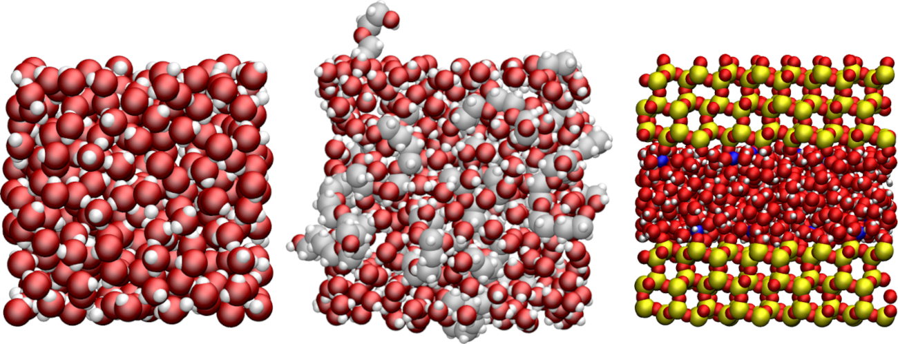

.. image:: https://readthedocs.org/projects/nmrformd/badge/?version=latest

.. image:: docs/source/figures/logo/banner-README.png

.. inclusion-readme-intro-start

NMRforMD is a python toolkit to calculate NMR relaxation times
from molecular dynamics trajectory files. Used in combination
with `MDAnalysis`_, it allows for the analysis of trajectory
files from any MDAnalysis-compatible simulation package, including
`LAMMPS`_ and `GROMACS`_.

..
	This documentation is separated in four parts: tutorials, how-to scripts,
	description, and theory.

.. _`MDAnalysis`: https://www.mdanalysis.org/
.. _`LAMMPS`: https://www.lammps.org/
.. _`GROMACS`: https://www.gromacs.org/
.. _`Github`: https://github.com/simongravelle/nmrformd

Notes :
    - NMRforMD is still in development, please raise an issue on `Github`_ if you encounter a problem
    - the code has mostly been tested with GROMACS and LAMMPS trajectory files, but should work with other molecular dynamics packages, as long as they are compatible with MDAnalysis
    - NMRforMD does not work with triclinic box, use MDAnalysis to convert your trajectory to orthorhombic
    
Example of systems that can be analysed using NMRforMD, from left to right: a 
bulk water reservoir, a PEG molecule, and water in a slit silica pore. 
    
.. inclusion-readme-intro-end

For details and instructions for beginners,
have a look at the `documentation`_.

Installation
------------

Using pip, type in a terminal:

.. code-block:: bash

	pip3 install nmrformd

To get the last version, clone this repository on your computer
and use pip3 from the main directory:

.. code-block:: bash

	git clone https://github.com/simongravelle/nmrformd.git
	
	cd nmrformd/

	pip install .
	
You can run the tests using pytest:
	
.. code-block:: bash	
	
	cd tests
	pytest .

Known issues
------------

- for very large trajectory file, the code requires a lot of memory
- the code has only beed tested with hydrogen atoms (spin 1/2)
- only works for dipolar interaction, not quadrupolar interaction

.. _`documentation`: https://nmrformd.readthedocs.io/en/latest/

