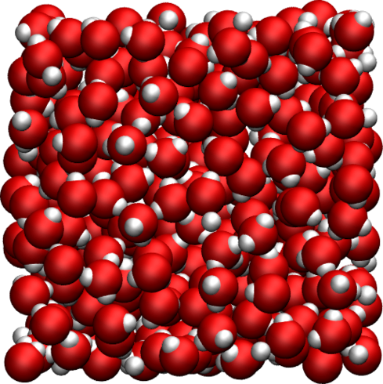
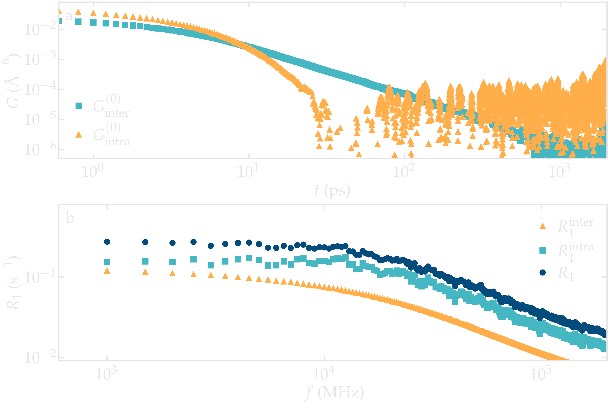
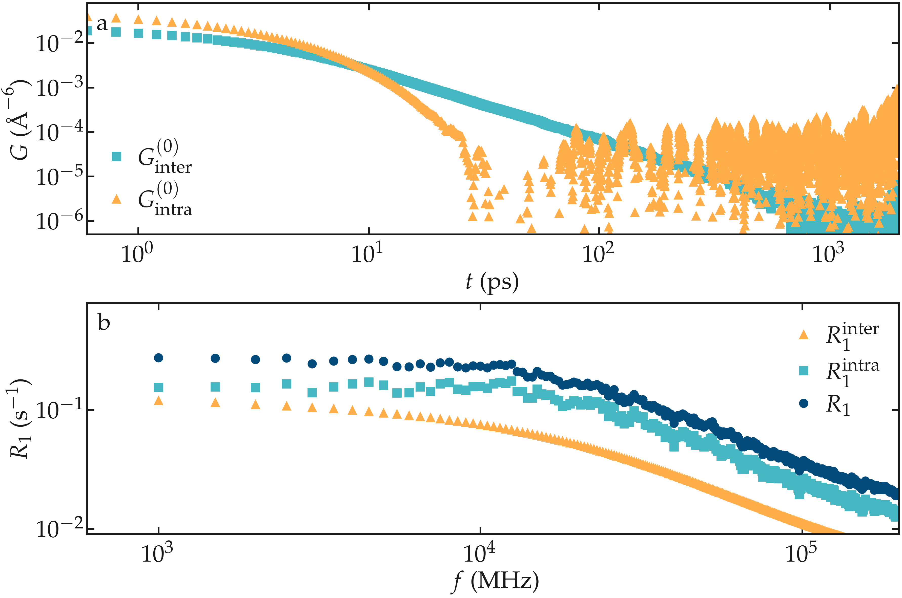
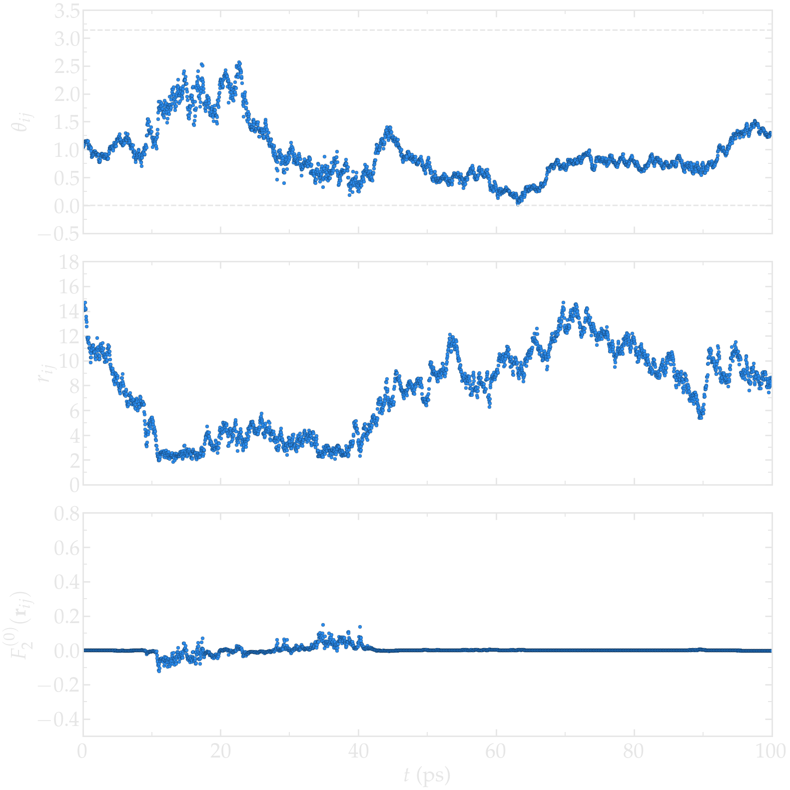
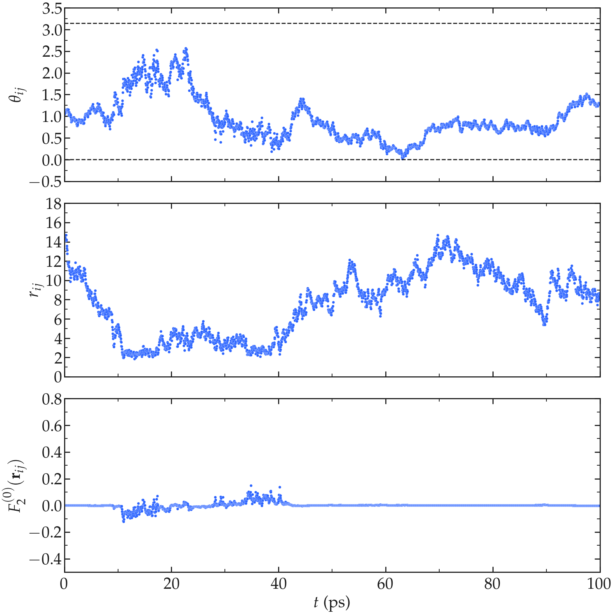

Bulk water
==========

.. container:: hatnote

   Measuring the NMR relaxation time of water

MD system
---------

.. container:: justify

    The system is a bulk liquid water with a number :math:`N` of water molecules,
    where :math:`N` was varied from 25 to 4000. The simulation box was cubic, 
    with equilibrium dimensions ranging from :math:`(0.9\,\text{nm})^3`
    to :math:`(4.9\,\text{nm})^3`. The trajectory was recorded
    during a :math:`8\,\text{ns}` production run performed with
    the open source codes LAMMPS (for the smallest systems) and GROMACS (for the largest systems).
    Simulations were performed in the NPT ensemble using a timestep of :math:`2\,\text{fs}`.
    The imposed was temperature :math:`T = 300\,^\circ\text{K}`, and the pressure
    :math:`p = 1\,\text{atm}`. The positions of the atoms were recorded in the *prod.xtc* file
    every :math:`\Delta t`, with :math:`\Delta t` ranging from :math:`0.2\,\text{ps}` to :math:`32\,\text{ps}`.

Results
-------

.. container:: justify

    Both intra and inter-molecular correlation functions were extracted, 
    and the respective intra and inter NMR spectra were calculated.
    The total NMR spectrum :math:`R_1` was also calculated.

.. container:: figurelegend

    Figure: a) Correlation function :math:`G^{(0)}` as extracted from the bulk
    water simulation with :math:`N = 4000` and :math:`N = \Delta t = 1\,\text{ps}`.
    b) Corresponding NMR spectra :math:`R_1`.

.. container:: justify

    The inter-molecular correlation function shows the expected power law at longer time,
    while the intra-molecular correlation decreases faster with time.

 .. container:: justify

    Our results also show that the relaxation is dominated by intra-molecular contribution,
    as expected for water under ambient conditions :cite:`singerMolecularDynamicsSimulations2017`.
    For the lowest frequency considered here, the spectrum :math:`R_1` is almost flat.

.. container:: justify

    Let us first visualize how :math:`r_{ij}` and :math:`\Omega_{ij}` evolve with time in the case of a 
    bulk water simulation at 300 K. For such bulk systems, it is known that the correlations functions 
    are proportional to each others :cite:`hubbardTheoryNuclearMagnetic1963`, so only :math:`G^{0}` and 
    :math:`J^{0}` will be evaluated, which depends only in the polar angle :math:`\theta_{ij}` as 
    :math:`Y^{0}_2` is independent from the azimuthal angle :math:`\varphi`.

.. container:: justify

    First, let us have a look at the intramolecular motion within a single water molecule. As expected
    for the rigid water model used here (TIP4P/:math:`\epsilon`), the 
    average distance :math:`r_{ij}` between the two hydrogen atoms of the same molecule remains
    constant (within the uncertainty of the shake algorithm used to maintain the water molecule rigid),
    while the polar angle :math:`\theta_{ij}` fluctuates with time, following the rotation of the
    water molecule (see the Figure below). The fluctuations of :math:`\theta_{ij}` with time lead to fluctuations of the
    function :math:`F_{0}^{(2)}` (see Eq. :eq:`F_2_0`) between a higher bound given by
    :math:`(3 \cos^2 0 - 1 ) / a^3 \approx 0.58\,A^{-3}`,
    where :math:`a \approx 1.51\,A` is the typical distance between the two hydrogen atoms of the water
    molecule, and a lower bound :math:`(3 \cos^2 \pi/2 - 1 ) / a^3 \approx -0.29\,\,A^{-3}`.

.. image:: ../figures/best-practices/intramolecular-signal-illustration-dark.png
    :class: only-dark
    :alt: NMR results obtained from the LAMMPS simulation of water

.. image:: ../figures/best-practices/intramolecular-signal-illustration-light.png
    :class: only-light
    :alt: NMR results obtained from the LAMMPS simulation of water

.. container:: justify

    **Figure:** a) :math:`\theta_{ij}` as a function of the time :math:`t`, where :math:`i` and :math:`j`
    refer to two hydrogen atoms located within the same water molecule. a) :math:`r_{ij}` as a function of 
    time. c) :math:`F_{2}^{(0)}` as a function of time. The temperature is 300 K, and 
    the total number of water molecules is 3000.

.. container:: justify

    Second, let us have a look at the intermolecular motion between two hydrogen atoms from two different
    molecules. In that case, :math:`r_{ij}` fluctuates significantly between :math:`\approx 2.5 A`,
    corresponding to the shortest typical distance between two molecules
    that are next to one another, to larger values (potentially as large as the box permits). 
    As can be seen, the function :math:`F_{0}^{(2)}` reaches its largest absolute values
    when :math:`r_{ij}` is the shorter.

.. container:: justify

    **Figure:** a) :math:`\theta_{ij}` as a function of the time :math:`t`, where :math:`i` and :math:`j`
    refer to two hydrogen atoms located within two different water molecules. a) :math:`r_{ij}` as a function of 
    time. c) :math:`F_{2}^{(0)}` as a function of time. The temperature is 300 K, and 
    the total number of water molecules is 3000.

.. container:: justify

    From the fluctuating quantities :math:`F_{0}^{(2)}` summed up over all the available pair of 
    spins, one can extract the two correlation functions :math:`G_\textrm{intra}^{(0)}` and
    :math:`G_\textrm{inter}^{(0)}` (see Eqs. :eq:`G_intra` and :eq:`G_inter`). For comparison,
    the results obtained with two different temperatures 275 and 300 K are reported.
    
    At short time $t < 40$ ps, the intra-molecular correlation functions follow and
    a decreasing exponential,

.. math::
    :label: eq_exp_G

    G_\text{intra} (t) = G_\text{intra} (0)  \exp{(-t / \tau_\text{intra})},

.. container:: justify

    where :math:`\tau_\text{intra} = 6.3` ps was used for :math:`T = 300` K 
    and :math:`\tau_\text{intra} = 3.2` ps was used for :math:`T = 275` K, see the figure 
    below. Exponentially decreasing correlation functions such as Eq. :eq:`eq_exp_G` are
    commonly used to describe systems for which the rotational diffusion
    is isotropic :cite:`lippensRelaxationTimeWater1993`.
    
    The inter-molecular correlation functions, however, scale as an
    exponential [i.e. Eq. :eq:`eq_exp_G`] only for time shorter than a 
    few tens of pico-second, and show a clear scaling as :math:`G_\text{inter} (t) \sim t^{-3/2}`
    for large time which is a characteristic signature of the diffusion
    process controlling the motion of the molecules. The scaling
    :math:`G_\text{inter} (t) \sim t^{-3/2}` has long been predicted, and 
    analytical expressions have been proposed by Ayant et al. :cite:`ayantCalculDensitesSpectrales1975` and
    Hwang and Freed :cite:`hwangDynamicEffectsPair2008`, in the context of freely diffusing hard spheres,
    

    Following Ref :cite:`grivetNMRRelaxationParameters2005`, this expression is here referred to 
    as a ADHF.

.. image:: ../figures/best-practices/gij-R1-illustration-dark.png
    :class: only-dark
    :alt: NMR results obtained from the LAMMPS simulation of water

.. image:: ../figures/best-practices/gij-R1-illustration-light.png
    :class: only-light
    :alt: NMR results obtained from the LAMMPS simulation of water

.. container:: justify

    The intra molecular spectrum :math:`J_\textrm{intra}^{(0)}` can be reasonably
    well adjusted by a Lorentzian

.. math::
    :label: eq_lorenzian_G

    J_\text{intra} (f) = G_\text{intra} (0) \dfrac{2 \tau_\text{c}}{1 + 4 \pi^2 f^2 \tau_\text{c}^2}

.. container:: justify

    using :math:`\tau_\text{c} = 6.3` ps and :math:`G(0) = 56300` A⁻⁶ ps⁻² for :math:`T = 300` K
    and :math:`\tau_\text{c} = 3.2` ps and :math:`G(0) = 59500` A⁻⁶ ps⁻² for :math:`T = 275` K. 

    The inter molecular spectrum :math:`J_\textrm{inter}^{(0)}`, however, does not follow the 
    Lorentzian plateau, particularly at the lowest frequencies, which is consistent with 
    the correlation function :math:`G_\textrm{inter}^{(0)}` decaying with time as a
    power law. In that case, and following closely Ref. :cite:`gravelleAdsorptionKineticsOpen2019`,
    an exact analytical expression for the surface spectrum :math:`J_\textrm{surf} (f)` can be
    obtained from the first return passage time of a molecule between successive
    adsorption and desorption at the surface of a sphere, in the limit of a large diffusing 
    reservoir:

.. math::
    :label: eq_spectrum_sqrt

    J_\text{inter} (f) \sim \left[ 1 + A + B \sqrt{ 2 \pi f} \right]^{-1}.

.. container:: justify

    Still from Ref. :cite:`gravelleAdsorptionKineticsOpen2019`, one can deduce that
    :math:`A = k r / D` and :math:`B = r / \sqrt{D}` where :math:`r` is here the radius
    of the water molecule, :math:`D` the diffusion coefficient, and :math:`k` a
    phenomenological rate constant with the units of m/s. The frequency scaling
    as predicted by equation :eq:`eq_spectrum_sqrt` is in good agreement with molecular 
    dynamics results at frequency lower than :math:`10^4` MHz.
