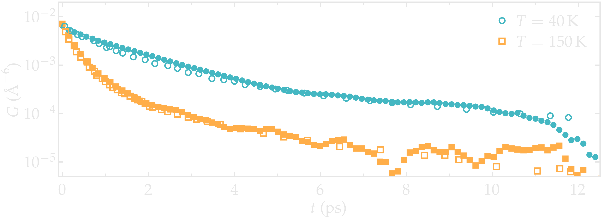
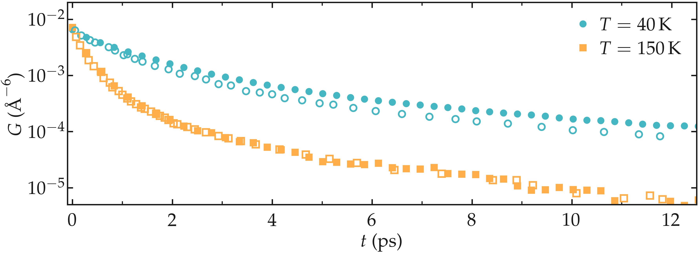

.. _lennard-jones-label:

Lennard-Jones fluid
===================

.. container:: hatnote

   Measuring the NMR relaxation time from a Lennard-Jones fluid

.. image:: ../figures/tutorials/isotropic-systems/snapshot-dark.png
    :class: only-dark
    :alt: PEG-water mixture simulated with LAMMPS - Dipolar NMR relaxation time calculation
    :width: 250
    :align: right

.. image:: ../figures/tutorials/isotropic-systems/snapshot-light.png
    :class: only-light
    :alt: PEG-water mixture simulated with LAMMPS - Dipolar NMR relaxation time calculation
    :width: 250
    :align: right

.. container:: justify

    In this tutorial, the NMR relaxation times :math:`T_1` and :math:`T_2`
    are measured from a bulk polymer-water mixture using |NMRforMD|.
    To follow the tutorial, |MDAnalysis|,
    |numpy|, and
    |matplotlib| must be installed.

.. |NMRforMD| raw:: html

   <a href="https://nmrformd.readthedocs.io" target="_blank">NMRforMD</a>

.. |MDAnalysis| raw:: html

   <a href="https://www.mdanalysis.org" target="_blank">MDAnalysis</a>

.. |numpy| raw:: html

   <a href="https://www.numpy.org" target="_blank">numpy</a>

.. |matplotlib| raw:: html

   <a href="https://www.matplotlib.org" target="_blank">matplotlib</a>

MD system
---------

.. container:: justify

    The system is made of 1638 particles interacting through the classical 
    Lennard-Jones (LJ) 12-6 potential with a cut-off of :math:`9\,\text{Å}`. Each particle
    was associated with a mass :math:`m = 1\,`g/mol, and LJ parameters :math:`\sigma = 3\,\text{Å}`
    and :math:`\epsilon = 0.1\,`kcal/mol. The volume of
    the box :math:`(37.5\,\text{Å})^3`  was chosen to match the 
    density of the paper by Grivet :cite:`grivetNMRRelaxationParameters2005`.
    Calculations were made at constant volume and energy, in the NVE ensemble.
    The total duration of the simulation was 11000 steps, and the data were recorded every 10 steps
    with a timestep of :math:`1.16\,\text{fs}`. The imposed temperatures
    were ranging from :math:`T = 30` to :math:`160\,\text{K}`.

.. container:: justify

    The parameters were chosen to match the reduced parameters used by Grivet :cite:`grivetNMRRelaxationParameters2005`,
    namely a reduced temperature ranging from :math:`T^* = 0.8` to 3.0,
    a density :math:`\rho^* = 0.84`. Note however, a smaller number of particles was used,
    as well as a smaller timestep, and a slightly longer cut-off.
    
.. container:: justify

    You can access all the simulation files
    and trajectories in this separate Github |repository-examples|.

.. |repository-examples| raw:: html

   <a href="https://github.com/simongravelle/nmrformd-data" target="_blank">repository</a>

.. container:: figurelegend

    Figure: NMR relaxation times :math:`T_1` (disks) and 
    :math:`T_2` (squares) as a function
    of the frequency :math:`f` for
    the :math:`\text{PEG-H}_2\text{O}` bulk mixture.
