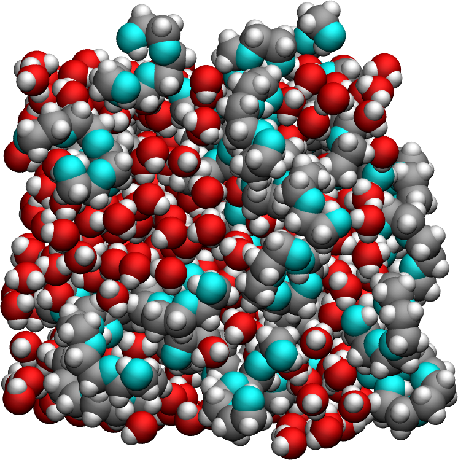
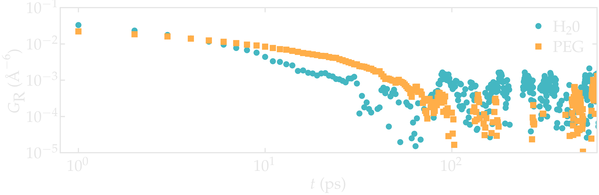

.. _lennard-jones-label:

Lennard-Jones fluid
===================

.. container:: hatnote

   Measuring the NMR relaxation time from a Lennard-Jones fluid

.. image:: ../figures/tutorials/isotropic-systems/snapshot-dark.png
    :class: only-dark
    :alt: PEG-water mixture simulated with LAMMPS - Dipolar NMR relaxation time calculation
    :width: 250
    :align: right

.. container:: justify

    In this tutorial, the NMR relaxation times :math:`T_1` and :math:`T_2`
    are measured from a bulk polymer-water mixture using |NMRforMD|.
    To follow the tutorial, |MDAnalysis|,
    |numpy|, and
    |matplotlib| must be installed.

.. |NMRforMD| raw:: html

   <a href="https://nmrformd.readthedocs.io" target="_blank">NMRforMD</a>

.. |MDAnalysis| raw:: html

   <a href="https://www.mdanalysis.org" target="_blank">MDAnalysis</a>

.. |numpy| raw:: html

   <a href="https://www.numpy.org" target="_blank">numpy</a>

.. |matplotlib| raw:: html

   <a href="https://www.matplotlib.org" target="_blank">matplotlib</a>

MD system
---------

.. container:: justify

    The system is made of 1638 particles interacting through the classical 
    Lennard-Jones (LJ) 12-6 potential with a cut-off of :math:`9\,\text{Å}`. Each particle
    was associated with a mass :math:`m = 1\,`g/mol, and LJ parameters :math:`\sigma = 3\,\text{Å}`
    and :math:`\epsilon = 0.1\,`kcal/mol. The volume of
    the box :math:`(37.5\,\text{Å})^3`  was chosen to match the 
    density of the paper by Grivet :cite:`grivetNMRRelaxationParameters2005`.
    Calculations were made at constant volume and energy, in the NVE ensemble.
    The total duration of the simulation was 11000 steps, and the data were recorded every 10 steps
    with a timestep of :math:`1.16\,\text{fs}`. The imposed temperatures
    were ranging from :math:`T = 30` to :math:`160\,\text{K}`.

.. container:: justify

    The parameters were chosen to match the reduced parameters used by Grivet :cite:`grivetNMRRelaxationParameters2005`,
    namely a reduced temperature ranging from :math:`T^* = 0.8` to 3.0,
    a density :math:`\rho^* = 0.84`. However, a slightly different number of particles,
    a smaller timestep, and a slightly longer cut-off was used here.
    
.. container:: justify

    You can access all the simulation files
    and trajectories in this separate Github |repository-examples|.

.. |repository-examples| raw:: html

   <a href="https://github.com/simongravelle/nmrformd-data" target="_blank">repository</a>

File preparation
----------------

.. container:: justify

    To access all trajectory files, simply clone
    the *NMRforMD* repository with its submodule:

.. code-block:: bash

    git clone --recurse-submodules https://github.com/simongravelle/nmrformd.git

.. container:: justify

    Here the secondary repository *nmrformd-data* is imported as
    as submodule. The dataset needed to follow this tutorial is located
    in *nmrformd-data/polymer-in-water/raw-data/NPEG32/*.

Create a MDAnalysis universe
----------------------------

.. container:: justify

    Open a new Python script or a new notebook, and define
    the path to the data files:

.. code-block:: python

	datapath = "mypath/nmrformd-data/polymer-in-water/raw-data/NPEG32/"

.. |repository| raw:: html

   <a href="ttps://github.com/simongravelle/nmrformd/tree/main/tests" target="_blank">repository</a>

.. container:: justify

    Then, import numpy, MDAnalysis, and NMRforMD:

.. code-block:: python

	import numpy as np
	import MDAnalysis as mda
	import nmrformd as nmrmd

.. container:: justify

    From the trajectory files, let us create a MDAnalysis universe.
    Import the configuration file and the trajectory:

.. code-block:: python

    u = mda.Universe(datapath+"init.data", datapath+"prod.xtc")
    u.transfer_to_memory(stop=501)

.. container:: justify

    The *u.transfer_to_memory(stop=501)*, is optional, it only serve to 
    reduce the number of frames, and therefore reduce the duration of 
    the calculation. Feel free to remove it, or increase its value.
    The figures here have been generated using the 
    full trajectory (i.e. without the *transfer_to_memory* command).

.. container:: justify

    The MDAnalysis universe *u* contains both topology (atoms types, masses, etc.)
    and trajectory (atom positions at every frame).

.. container:: justify

    Let us extract a few information from the universe,
    such as number of molecules (water + PEG), timestep, and total duration:

.. code-block:: python

	n_molecules = u.atoms.n_residues
	print(f"The number of molecules is {n_molecules}")

.. code-block:: bw

    >> The number of molecules is 352

.. code-block:: python

	timestep = np.int32(u.trajectory.dt)
	print(f"The timestep is {timestep} ps")

.. code-block:: bw

    >> The timestep is 1 ps

.. code-block:: python

	total_time = np.int32(u.trajectory.totaltime)
	print(f"The total simulation time is {total_time} ps")

.. code-block:: bw

    >> The total simulation time is 1000 ps

.. container:: justify

    Note that in the context of MDAnalysis,
    the *timestep* refers to the duration
    between two recorded frames, which is different from the actual
    timestep of :math:`1\,\text{fs}` used for the LAMMPS
    molecular dynamics simulation.

Launch the NMR analysis
-----------------------

.. container:: justify

    Let us create 3 atom groups for respectively the hydrogen
    atoms of the PEG, the hydrogen
    atoms of the water, and all the hydrogen atoms:

.. code-block:: python

    H_PEG = u.select_atoms("type 3 5")
    H_H2O = u.select_atoms("type 7")
    H_ALL = H_PEG + H_H2O

.. container:: justify

    Then, let us run NMRforMD for all the hydrogen atoms:

.. code-block:: python

	nmr_ALL = nmrmd.NMR(u, atom_group = H_ALL, neighbor_group = H_ALL, number_i=40)

.. container:: justify

    With 'number_i = 40', only 40 randomly selected atoms within 'H_ALL' are
    considered for the calculation. Increase this number for better resolution,
    and use 'number_i = 0' to consider all the atoms.

Extract the NMR spectra
-----------------------

.. container:: justify

    Let us access the calculated value of the NMR relaxation time :math:`T_1`:

.. code-block:: python

    T1 = np.round(nmr_ALL.T1,2)
    print(f"The total NMR relaxation time is T1 = {T1} s")

.. code-block:: bw

    >> NMR relaxation time T1 = 2.53 s

..  container:: justify

    The value you obtain may vary, depending on which hydrogen atoms
    were randomly selected for the calculation.

..  container:: justify

    The full :math:`T_1` and :math:`T_2` spectra can be extracted as well
    as 1/nmr_ALL.R1 and 1/nmr_ALL.R2, respectively,
    and the corresponding frequency is given by nmr_ALL.f.

.. code-block:: python

    R1_spectrum = nmr_ALL.R1
    R2_spectrum = nmr_ALL.R2
    T1_spectrum = 1/R1_spectrum
    T2_spectrum = 1/R2_spectrum
    f = nmr_ALL.f

..  container:: justify

    The spectra :math:`T_1` and :math:`T_2` can then be
    plotted as a function of :math:`f` using pyplot.

.. code-block:: python

    from matplotlib import pyplot as plt
    plt.loglog(f, T1_spectrum, 'o')
    plt.loglog(f, T2_spectrum, 's')
    plt.show()

.. image:: ../figures/tutorials/isotropic-systems/T1-dark.png
    :class: only-dark
    :alt: NMR results obtained from the LAMMPS simulation of water

.. image:: ../figures/tutorials/isotropic-systems/T1-light.png
    :class: only-light
    :alt: NMR results obtained from the LAMMPS simulation of water

.. container:: figurelegend

    Figure: NMR relaxation times :math:`T_1` (disks) and 
    :math:`T_2` (squares) as a function
    of the frequency :math:`f` for
    the :math:`\text{PEG-H}_2\text{O}` bulk mixture.

Calculate the intra-molecular NMR relaxation
--------------------------------------------

..  container:: justify

    Let us measuring the intra-molecular contribution to the NMR
    relaxation time measurement. To make the analysis easier,
    let us also differentiate between PEG and :math:`\text{H}_2\text{O}`
    molecule, and perform 2 separate analyses.

.. code-block:: python

    nmr_H2O_intra = nmrmd.NMR(u, atom_group = H_H2O, type_analysis="intra_molecular", number_i=40)
    nmr_PEG_intra = nmrmd.NMR(u, atom_group = H_PEG, type_analysis="intra_molecular", number_i=40)

..  container:: justify

    The correlation function Gij can be accessed from nmr_H2O_intra.gij[0],
    and the time  from nmr_H2O_intra.t.

.. code-block:: python

    t = nmr_PEG_intra.t
    G_intra_H2O = nmr_H2O_intra.gij[0]
    G_intra_PEG = nmr_PEG_intra.gij[0]

.. container:: figurelegend

    Figure: Intra-molecular correlation function :math:`G_\text{R}`
    for both PEG (squares) and :math:`\text{H}_2\text{O}` (disks).

..  container:: justify

    From the correlation functions, one can obtain the typical
    rotational time of the molecules.

.. code-block:: python

    tau_rot_H2O = np.round(np.trapz(G_intra_H2O, t)/G_intra_H2O[0],2)
    tau_rot_PEG = np.round(np.trapz(G_intra_PEG, t)/G_intra_PEG[0],2)
    print(f"The rotational time of H2O is = {tau_rot_H2O} ps")
    print(f"The rotational time of PEG is = {tau_rot_PEG} ps")

.. code-block:: bw

    >> The rotational time of H2O is = 6.35 ps
    >> The rotational time of PEG is = 8.34 ps