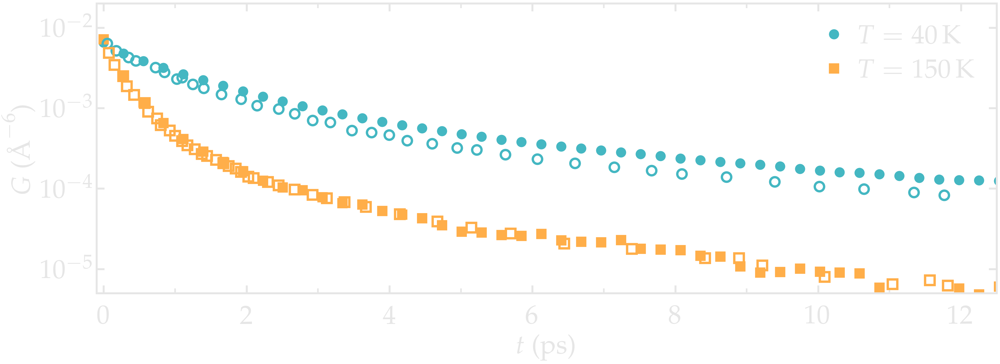
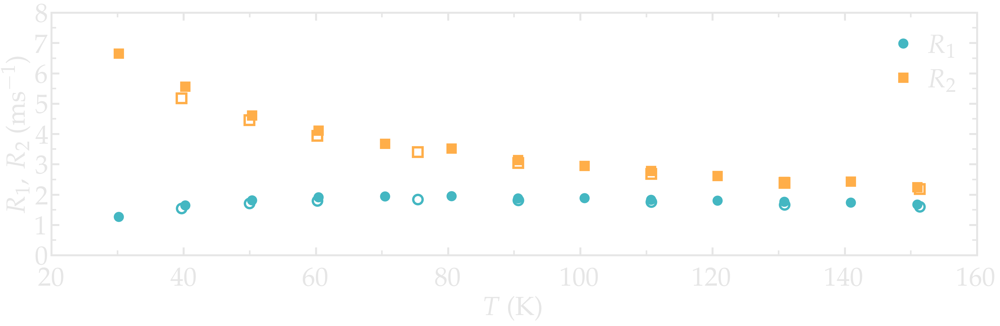
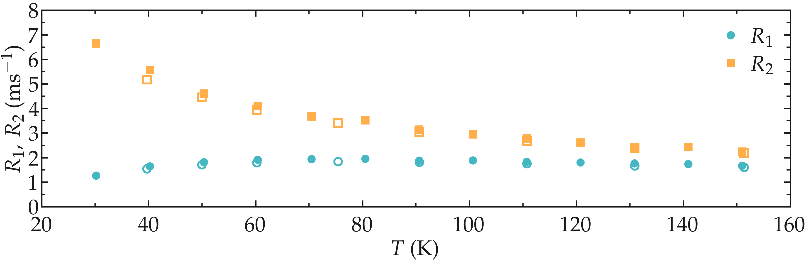

.. _lennard-jones-label:

Lennard-Jones fluid
===================

MD system
---------

.. container:: hatnote

   Measuring the NMR relaxation time from a Lennard-Jones fluid

.. container:: justify

    The system is made of 1638 particles interacting through the classical 
    Lennard-Jones (LJ) 12-6 potential with a cut-off of :math:`9\,\text{Å}`. Each particle
    was associated with a mass :math:`m = 1\,\text{g/mol}`,
    and LJ parameters :math:`\sigma = 3\,\text{Å}`
    and :math:`\epsilon = 0.1\,\text{kcal/mol}`. The volume of
    the box :math:`(37.5\,\text{Å})^3`  was chosen to match the 
    density of the paper by Grivet :cite:`grivetNMRRelaxationParameters2005`.
    Calculations were made at constant volume and energy, in the NVE ensemble.
    The total duration of the simulation was 11000 steps, and the data were recorded every 10 steps
    with a timestep of :math:`1.16\,\text{fs}`. The imposed temperatures
    were ranging from :math:`T = 30` to :math:`160\,\text{K}`.

.. container:: justify

    The parameters were chosen to match the reduced parameters used by Grivet :cite:`grivetNMRRelaxationParameters2005`,
    namely a reduced temperature ranging from :math:`T^* = 0.8` to 3.0,
    a density :math:`\rho^* = 0.84`. Note however, a smaller number of particles was used,
    as well as a smaller timestep, and a slightly longer cut-off.
    
.. container:: justify

    You can access all the simulation files
    and trajectories in this separate Github |repository-examples|.

.. |repository-examples| raw:: html

   <a href="https://github.com/simongravelle/nmrformd-data" target="_blank">repository</a>

Results
-------

.. container:: justify

    The correlation function :math:`G^{(0)}` was first extract for two temperatures, :math:`T = 50`
    and :math:`140\,\text{K}`, and compared with the correlation functions reported by Grivet :cite:`grivetNMRRelaxationParameters2005`.
    Our results show an excellent agreement with the results from Grivet, thus validating the
    NMR formalism used here as well as the LJ system and parameters. 

.. image:: ../figures/illustrations/lennard-jones-fluid/G_correlation-light.png
    :class: only-light
    :alt: NMR results obtained from the LAMMPS simulation of water

.. container:: figurelegend

    Figure: Correlation function :math:`G^{(0)}` as extracted from the LJ fluid simulation
    for two different temperatures, and compared with the data from Grivet :cite:`grivetNMRRelaxationParameters2005` (open symbols).

.. container:: justify

    The NMR relaxation rates :math:`R_1`
    and :math:`R_2` was also extracted for all the temperatures, at
    a frequency :math:`f_0 = 150\,\text{GHz}`. Our results
    show a good agreement with the data from Grivet :cite:`grivetNMRRelaxationParameters2005`.

.. container:: figurelegend

    Figure: NMR relaxation rates :math:`R_1`
    and :math:`R_2` at
    a frequency :math:`f_0 = 150\,\text{GHz}`. 
    The data from Grivet :cite:`grivetNMRRelaxationParameters2005` are shown with open symbols.