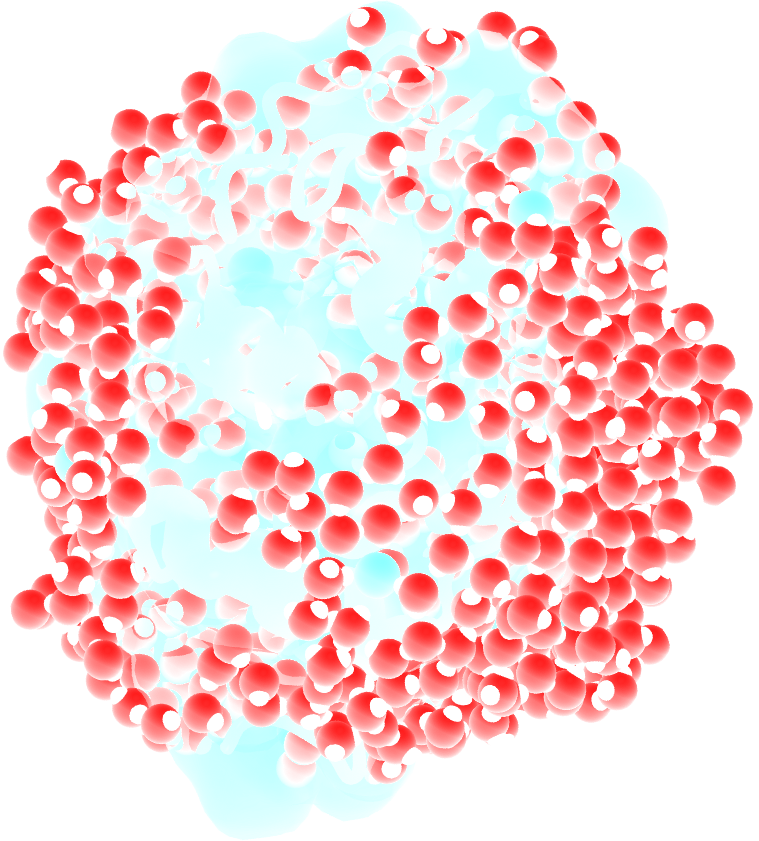
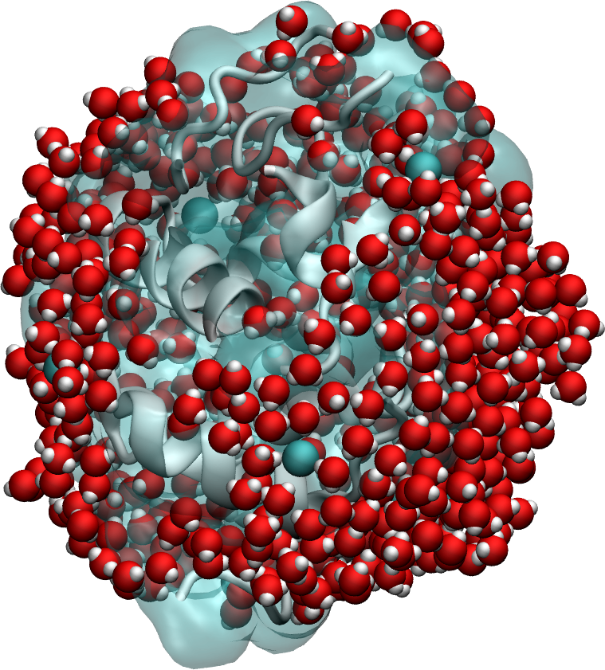
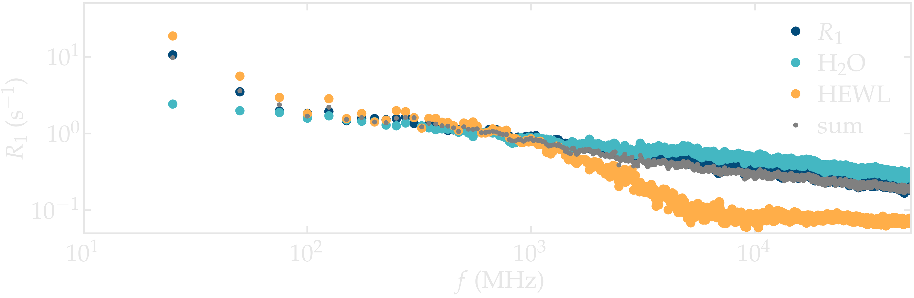
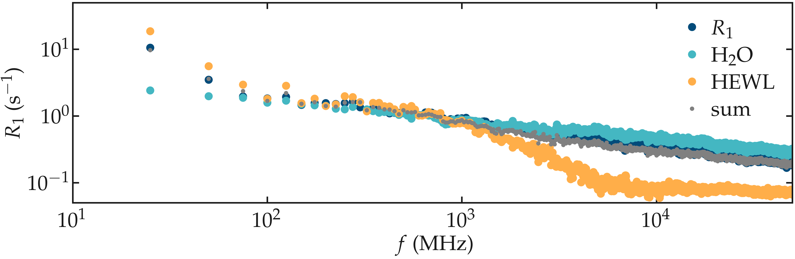

.. _lysozyme-label:

Lysozyme in water
=================

.. container:: hatnote

   Measuring the NMR relaxation time from a hydrated lysozyme

MD system
---------

.. container:: justify

    The system is made of a lysozyme (HEWL) with 594 water molecules, which
    corresponds to water-to-protein mass ratio of :math:`73\,\%`.
    The simulation was made using GROMACS using a timestep of :math:`1\,\text{fs}`.
    
.. container:: justify

    You can access all the simulation files
    and trajectories in this separate Github |repository-examples|.

.. |repository-examples| raw:: html

   <a href="https://github.com/simongravelle/nmrformd-data" target="_blank">repository</a>

Results
-------

.. container:: justify

    NMR relaxation rate :math:`R_1` was measured. The spectra show variations
    with the frequency :math:`f` down to frequency values as low as a few MegaHertz,
    which is due to the lysozyme. The spectrum for water alone still shows
    a slight variation with frequency, which is not the case for bulk water, and is 
    likely induced by the interaction with the protein, as adsorbed water molecules
    are expected to share the slower motion of the protein.

.. container:: justify

    **Figure:** NMR relaxation rate :math:`R_1` for water alone,
    lysozyme alone, and the full system.