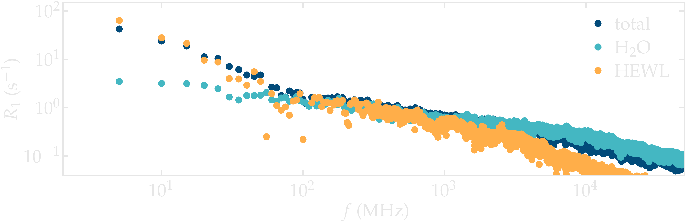
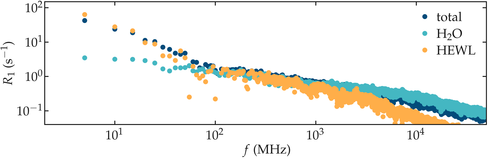

.. _lysozyme-label:

Lysozyme in water
=================

.. container:: hatnote

   Measuring the NMR relaxation time from a hydrated lysozyme

MD system
---------

.. image:: ../figures/illustrations/lysozyme-in-water/snapshot-dark.png
    :class: only-dark
    :alt: lysozyme in water simulated with GROMACS - Dipolar NMR relaxation time calculation
    :width: 250
    :align: right

.. container:: justify

    The system is made of a lysozyme (HEWL) with 594 water molecules, which
    corresponds to water-to-protein mass ratio of :math:`73\,\%`.
    The simulation was made using GROMACS using a timestep of :math:`2\,\text{fs}`.
    The production run was performed for 100 ns, and the trajectory
    was recorded with a period :math:`\Delta t = 1 \,\text{ps}`.
    The temperature was imposed to be 300 K.

Results
-------

.. container:: justify

    NMR relaxation rate :math:`R_1` was measured. The spectra show variations
    with the frequency :math:`f` down to the lower frequency accessible.
    When splitting the signal into the water and the lysozyme contribution, it
    appears that the variation of :math:`R_1` at low frequency is primarily
    due to the lysozyme. The spectrum for water alone shows
    a slight variation with frequency even at the lowest frequency, which is 
    likely induced by the interaction with the protein: the adsorbed water molecules
    are expected to move more slowly as free water.

.. container:: justify

    **Figure:** NMR relaxation rate :math:`R_1` for the lysozyme-water system.
    The spectra for water alone and lysozyme alone are also given.

.. container:: justify

    The effect of the interaction with the lysozyme on the NMR relaxation properties of
    the water is made apparent when compared to pure bulk water. The spectrum from
    bulk water shows a plateau for frequency lower than :math:`\approx 2 \cdot 10^3` MHz,
    while the spectrum from the water in contact with the lysozyme varies for frequencies 
    down to :math:`\approx 10` MHz, highlighting slower characteristic motion of the molecules.

.. container:: justify

    **Figure:** Contribution to the NMR relaxation rate :math:`R_1` from the water only,
    comparing the residual water in contact with the lysozyme, and pure bulk water.