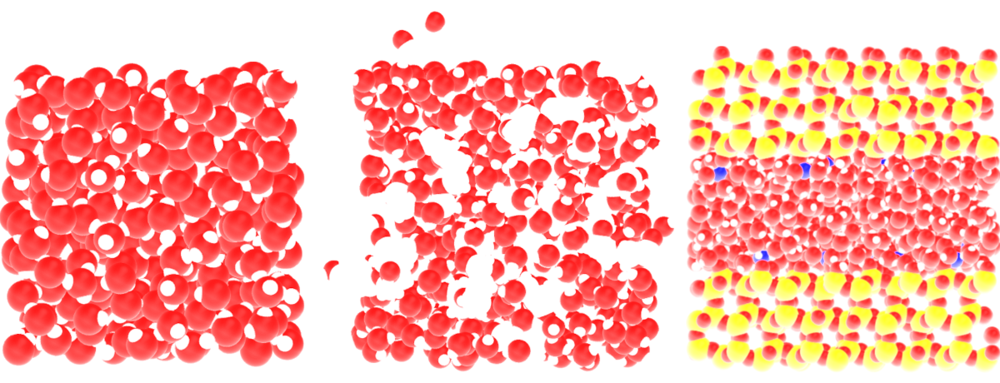
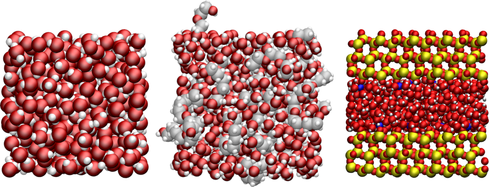

NMR for MD
==========

.. include:: ../../README.rst
   :start-after: inclusion-readme-intro-start
   :end-before: inclusion-readme-intro-end

.. container:: justify

    Figure : Example of systems that can be analysed using NMRforMD, from left to right: a 
    bulk water system, a polymer-water mixture, and water in a slit silica pore with sodium counter-ions.

.. toctree::
   :maxdepth: 2
   :hidden:

   tutorials/installation
   modules/NMR
   modules/utilities

.. toctree::
   :maxdepth: 2
   :caption: Tutorials
   :hidden:
   
   tutorials/bulk-water
   tutorials/solvated-polymers
   tutorials/water-in-silica

.. toctree::
   :maxdepth: 2
   :caption: Theory
   :hidden:

   theory/context
   theory/theory
   theory/illustration
   theory/best-practice
   theory/bibliography
