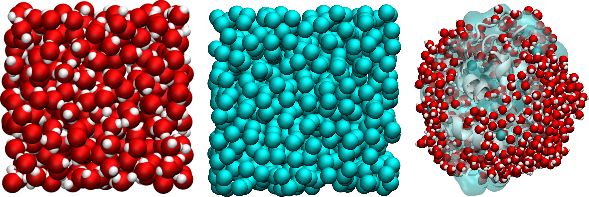

NMR fom MD
==========

.. container:: justify

    Dipolar Nuclear Magnetic Resonance for Molecular Dynamics
    (NMRforMD or formerly NMRforMD) simulations
    is a Python toolkit designed for the computation of
    dipolar NMR relaxation times (the so called $T_1$ and $T_2$)
    from molecular dynamics simulations.
    Used in combination with |MDAnalysis|,
    NMRforMD allows for the analysis of trajectory
    files from any MDAnalysis-compatible simulation package, including
    |LAMMPS| and |GROMACS|.

.. |MDAnalysis| raw:: html

   <a href="https://www.mdanalysis.org/" target="_blank">MDAnalysis</a>

.. |LAMMPS| raw:: html

   <a href="https://www.lammps.org/" target="_blank">LAMMPS</a>

.. |GROMACS| raw:: html

   <a href="https://www.gromacs.org/" target="_blank">GROMACS</a>

.. container:: figurelegend

    Figure: Example of systems that can be analysed
    using NMRforMD, from left to right: a lennard-jones fluid,
    a bulk water system, and a lysozyme in water.

.. toctree::
   :maxdepth: 2
   :hidden:

   modules/NMR
   modules/utilities

.. toctree::
   :maxdepth: 2
   :caption: Tutorials
   :hidden:
   
   tutorials/installation
   tutorials/isotropic-system
   tutorials/anisotropic-system

.. toctree::
   :maxdepth: 2
   :caption: Illustrations
   :hidden:

   illustrations/lennard-jones-fluids
   illustrations/bulk-water
   illustrations/lysozyme-in-water

.. toctree::
   :maxdepth: 2
   :caption: Theory
   :hidden:

   theory/context
   theory/dipolar_relaxation
   theory/best-practice

.. toctree::
   :maxdepth: 2
   :caption: Additional
   :hidden:

   additional/bibliography
   additional/acknowledgments
