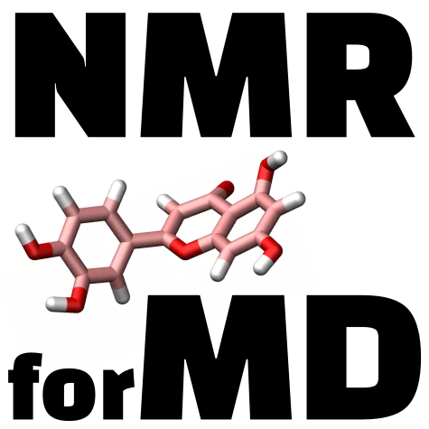

MNRforMD
========

.. include:: ../../README.rst
   :start-after: inclusion-readme-intro-start
   :end-before: inclusion-readme-intro-end

Note : NMRforMD is still in development, please raise an issue on `Github`_
if you encounter a problem.

.. _`Github`: https://github.com/simongravelle/nmrformd

.. toctree::
   :maxdepth: 2
   :caption: Tutorials
   :hidden:
   
   ./tutorials/installation
   ./tutorials/tutorial01

#.. toctree::
#   :maxdepth: 2
#   :caption: How-to scripts
#   :hidden:

#   ./documentation_pages/installation
#   ./documentation_pages/tutorial1

#.. toctree::
#   :maxdepth: 2
#   :caption: Description
#   :hidden:

#   ./modules/NMR

#.. toctree::
#   :maxdepth: 2
#   :caption: Theory
#   :hidden:

#   ./documentation_pages/changelog
