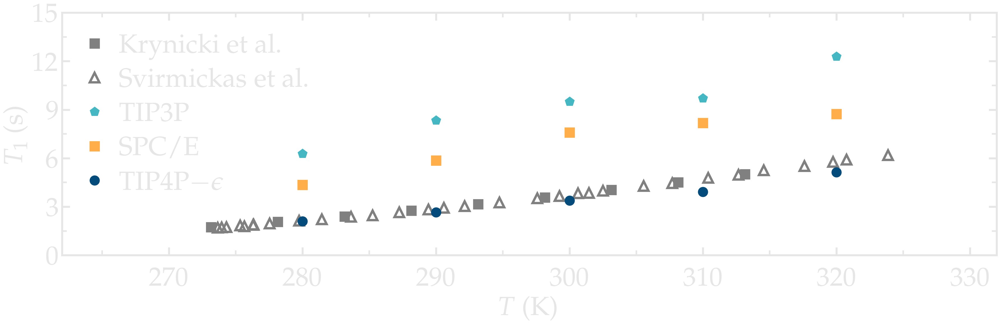
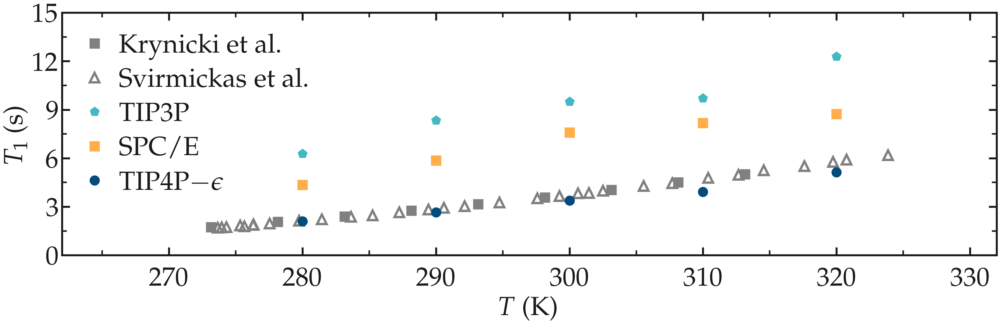
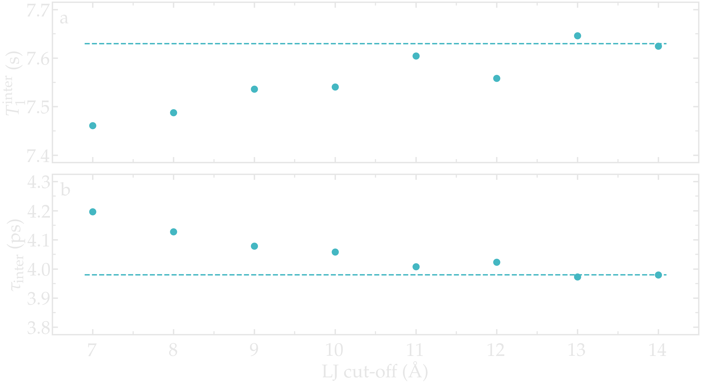
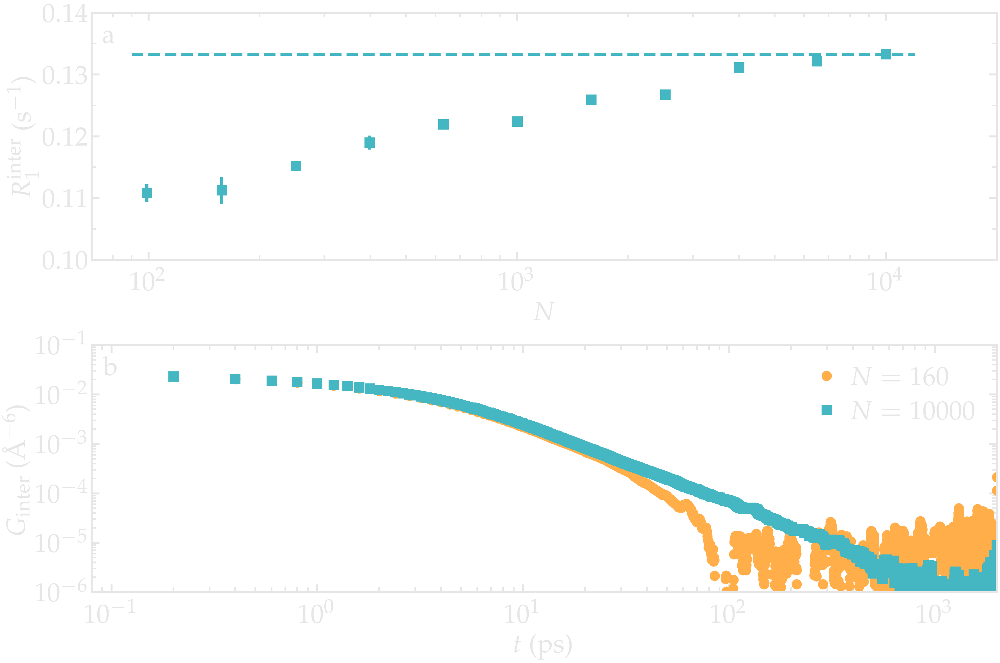
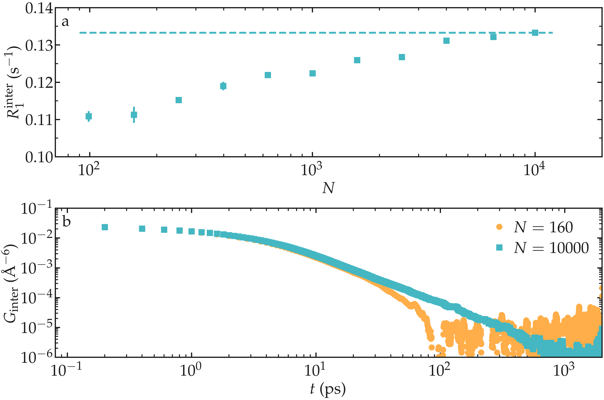

Best practice
=============

Choosing the right force field
------------------------------

.. container:: justify

    The agreement between experiments and simulations can only be as good as the
    force field used in the simulations. Although it has been shown that some
    force fields lead to excellent agreement with experimental data, as for instance
    for water, hydrocarbons, or polymer melts
    :cite:`singerMolecularDynamicsSimulations2017,gravelleNMRInvestigationWater2023,gravelleAssessingValidityNMR2023`,
    it is important to keep in mind that force fields are often parametrized
    to reproduce thermodynamic quantities, such as solvation energy.
    However, NMR relaxation times depend on both structural
    and dynamical quantities, and large differences between experiments
    and simulations are expected for poorly accurate force fields.

.. container:: justify

    As an illustration, the NMR relaxation time :math:`T_1`
    of bulk water was measured as a function of the temperature
    for three different water models:
    :math:`\text{TIP4P}-\epsilon` :cite:`fuentes-azcatlNonPolarizableForceField2014`,
    :math:`\text{SPC/E}` :cite:`berendsenMissingTermEffective1987`,
    and :math:`\text{TIP3P}` :cite:`jorgensenComparisonSimplePotential1983`.
    Our results show that the :math:`\text{TIP4P}-\epsilon` water models
    is in excellent agreement with experimental measurements from 
    Krynicki et al. :cite:`krynickiProtonSpinlatticeRelaxation1966`
    and Hindman et al. :cite:`hindmanRelaxationProcessesWater2003`.
    By contrast, :math:`\text{SPC/E}` and :math:`\text{TIP3P}`
    both overestimate the NMR relaxation time :math:`T_1`, in 
    excellent agreement with previous results
    by Calero et al. :cite:`calero1HNuclearSpin2015`. Note that Calero et al.
    used :math:`\text{TIP4P}-2005` water model instead of the :math:`\text{TIP4P}-\epsilon` model used here,
    however these two models show very similar structures and viscosities for liquid water :cite:`fuentes-azcatlNonPolarizableForceField2014`,
    and are thus expected to yield similar relaxation times.

.. container:: figurelegend

    Figure: NMR relaxation time :math:`T_1` between MD simulations of bulk 
    water obtained with three different water models:
    :math:`\text{TIP4P}-\epsilon` :cite:`fuentes-azcatlNonPolarizableForceField2014`,
    :math:`\text{SPC/E}` :cite:`berendsenMissingTermEffective1987`,
    and :math:`\text{TIP3P}` :cite:`jorgensenComparisonSimplePotential1983`.
    Results are compared with experiments 
    from Krynicki et al. :cite:`krynickiProtonSpinlatticeRelaxation1966`
    and from Hindman et al. :cite:`hindmanRelaxationProcessesWater2003`.

Simulation accuracy
-------------------

.. container:: justify

    NMR relaxation measurements are sensitive both thermodynamic and dynamic quantities, 
    and it is therefore important to ensure the accuracy of the molecular simulation.
    Several parameters are known to affect the accuracy of the simulations,
    such as the force field (as discussed previously), the time step, the cut-offs,
    or the sampling time
    :cite:`frenkelUnderstandingMolecularSimulation2002,allenComputerSimulationLiquids2017`.

.. container:: justify

    As an illustration, the NMR relaxation time :math:`T_1`
    of bulk water was measured as a function of the LJ cut-off.
    Our results show that, for the smallest cut-off,
    the inter-molecular :math:`T_1^\text{inter}` is slightly
    under-estimated, which is mainly due to an over-estimation
    of the inter-molecular characteristic time :math:`\tau_\text{inter}`.
    Our results also indicate that for a cut-off of 1\,nm,
    which is commonly used value, a small error of 
    about 1\,\% is induced. These observations are consistent
    with previous measurements :cite:`gravelleNMRInvestigationWater2023`,
    and confirm that care must be taken if one attempt in reproducing
    accurately NMR quantities.

.. container:: figurelegend

    Figure: a) Inter-molecular NMR relaxation time :math:`T_1^\text{inter}`
    as a function of the LJ cut-off for a bulk water system.
    b) Inter-molecular characteristic time :math:`\tau_\text{inter}`
    as a function of LJ cut-off.

Box size
--------

.. container:: justify

    NMR relaxation measurements are sensitive to the box size, as small 
    systems are known to suffer from finite-size effects.

.. container:: justify

    As an illustration, the NMR relaxation rate :math:`R_1`
    was measured both water with different number of molecules.

.. container:: figurelegend

    Figure: NMR relaxation rate :math:`R_1` as a function of the number of molecules
    for a bulk water system. For the smallest systems, results were averaged
    from up to 10 independent simulations and the error bar is calculated from
    the standard deviation.

.. image:: ../figures/best-practices/size-effect-tau-R1-dark.png
    :class: only-dark
    :alt: NMR results obtained from the LAMMPS simulation of water

.. image:: ../figures/best-practices/size-effect-tau-R1-light.png
    :class: only-light
    :alt: NMR results obtained from the LAMMPS simulation of water

.. container:: justify

    Looking at the correlation functions, a strong effect of the box size can be 
    see on the inter-molecular contribution, while almost no effect is seen 
    on the intra-molecular contribution:

.. image:: ../figures/best-practices/size-effect-gij-light.png
    :class: only-light
    :alt: NMR results obtained from the LAMMPS simulation of water

.. container:: justify

    Despite the strongly modified correlation functions obtained for small boxes,
    the relaxation rate is not so affected:

.. image:: ../figures/best-practices/size-effect-R1-dark.png
    :class: only-dark
    :alt: NMR results obtained from the LAMMPS simulation of water

.. image:: ../figures/best-practices/size-effect-R1-light.png
    :class: only-light
    :alt: NMR results obtained from the LAMMPS simulation of water

Dumping frequency
-----------------

.. container:: justify

    The dumping frequency sets the temporal resolution of the analysis.
    The maximum dumping period that can be used is system-dependent
    and must typically be much smaller than the correlation times.
    If the typical correlation times in the system is not known,
    the appropriate dumping frequency :math:`\Delta t` can
    be identified from convergence testing.
    Note however than using a high dumping frequency
    increases the size of the trajectory files, which in turn
    can make the computation of NMR relaxation rates
    computationally expensive.

.. container:: justify

    As an illustration, the NMR relaxation time :math:`T_1` was measured
    for an increasing dumping period from :math:`\Delta t = 0.02\,\text{ps}`
    to :math:`5\,\text{ps}`. Our results show that using a dumping period
    larger than about :math:`\Delta t = 0.5\,\text{ps}` leads to a significant decrease
    of the measured relaxation time :math:`T_1`. The decrease in :math:`T_1`
    is accompanied by an increase of the measured inter-molecular
    relaxation times :math:`\tau_\text{inter}`. 

.. image:: ../figures/illustrations/bulk-water/effect_dumping_frequency-dark.png
    :class: only-dark
    :alt: NMR results obtained from the LAMMPS simulation of water

.. container:: figurelegend

    Figure: a) Convergence testing showing the NMR relaxation time :math:`T_1`
    as a function of the trajectory dumping frequency :math:`\Delta t`
    for a bulk water system at :math:`T = 300 \text{K}`.
    The dashed line show the value for :math:`T_1`
    for :math:`\Delta t \to 0`.
    b) Inter-molecular relaxation times :math:`\tau_\text{inter}` as 
    a function of :math:`\Delta t`.