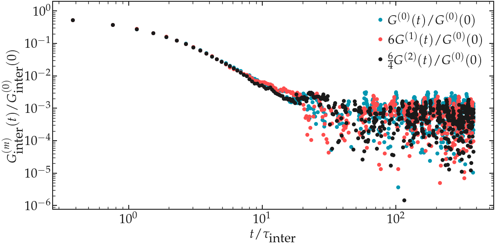

Best practice
=============

Choosing the force field
------------------------

.. container:: justify

    The agreement between experiments and simulations can only be as good as the
    force field used in the simulations. Although it has been shown that some
    force fields lead to excellent agreement with experimental data, as for instance
    for water, hydrocarbons, or polymer melts
    :cite:`singerMolecularDynamicsSimulations2017,gravelleNMRInvestigationWater2023,gravelleAssessingValidityNMR2023`,
    it is important to keep in mind that force fields are usually parametrized
    based on thermodynamic quantities. Since NMR relaxation quantities
    depend on both structural and dynamical quantities, differences between experiments
    and simulations can sometimes be expected.

Simulation accuracy
-------------------

.. container:: justify

    Since NMR relaxation rate measurements are sensitive both thermodynamic and dynamic quantities, 
    it is important to ensure the accuracy of the simulation.
    For instance, the cut-off for the Lennard-Jones interaction has a slight impact
    on the value :math:`R_1` :cite:`gravelleNMRInvestigationWater2023`.

Box size
--------

.. container:: justify

    NMR relaxation measurements are not extremely sensitive to the box size, however,
    a small effect of the box size can be see, particularly when reaching extremely small boxes:

.. image:: ../figures/best-practices/size-effect-tau-R1-dark.png
    :class: only-dark
    :alt: NMR results obtained from the LAMMPS simulation of water

.. image:: ../figures/best-practices/size-effect-tau-R1-light.png
    :class: only-light
    :alt: NMR results obtained from the LAMMPS simulation of water

.. container:: justify

    Looking at the correlation functions, a strong effect of the box size can be 
    see on the inter-molecular contribution, while almost no effect is seen 
    on the intra-molecular contribution:

.. image:: ../figures/best-practices/size-effect-gij-dark.png
    :class: only-dark
    :alt: NMR results obtained from the LAMMPS simulation of water

.. container:: justify

    Despite the strongly modified correlation functions obtained for small boxes,
    the relaxation rate is not so affected:

.. image:: ../figures/best-practices/size-effect-R1-light.png
    :class: only-light
    :alt: NMR results obtained from the LAMMPS simulation of water

Simulation duration
-------------------

.. container:: justify

    For comparison with experimental value, the total duration of the simulation
    must either be larger than :math:`\tau_c`, where :math:`\tau_c` is the longest
    characteristic motion in the system, or be low enough to match the actual Larmor
    frequency used in experiments.

Dumping frequency
-----------------

.. container:: justify

    Dumping period must be smaller than the smaller correlation time of the system, or a 
    significative error on :math:`R_1` will be connected.

For bulk system: check isotropy
-------------------------------

.. container:: justify

    Although generally true for bulk systems, as showed for glycerol :cite:`becherMolecularDynamicsSimulations2021`,
    it can be worth ensuring that the relation

.. math::

    \frac{1}{6} G^{(0)} (t) = G^{(1)} (t) = \frac{1}{4} G^{(2)} (t) 

.. container:: justify

    actually stands. For a system of bulk water, the superimposition is clearly verified:

    #todo : superimpose water, PEG-water, and slit silica on the same graph

.. image:: ../figures/best-practices/proportionality-dark.png
    :class: only-dark
    :alt: NMR results obtained from the LAMMPS simulation of water

.. container:: justify

    If not, all three correlation functions must be calculated.
