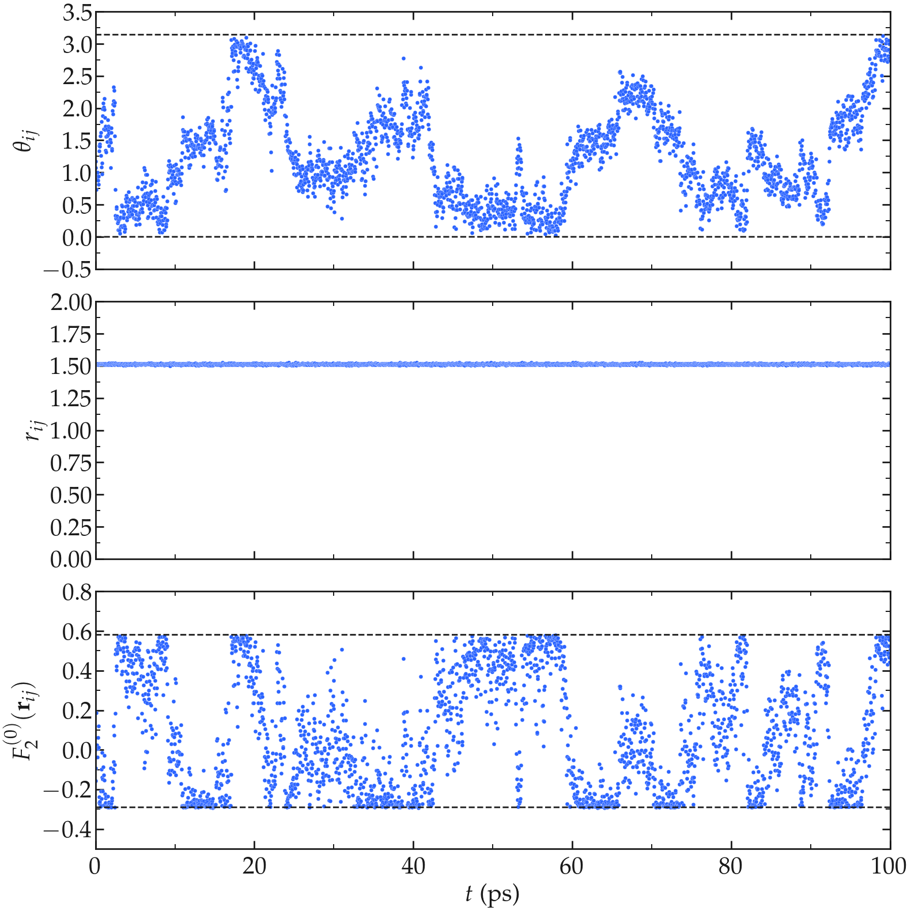

Illustration
============

.. container:: justify

    Let us first visualize how :math:`r_{ij}` and :math:`\Omega_{ij}` evolve with time in the case of a 
    bulk water simulation at 300 K.
    First, look at the intramolecular motion within a single (rigid) water molecule. As expected, the 
    average distance :math:`r_{ij}` between the two hydrogens atoms within the same molecule remains
    constant (within the uncertainty of the shake algorithm used to maintain the water molecule rigid),
    while the polar angle :math:`\theta_{ij}` fluctuates due to the molecule rotating. Following the 
    fluctuations of :math:`\theta_{ij}`, the function :math:`F_{0}^{(2)}` fluctuates with time 
    between the bounds given by :math:`(3 \cos^2 0 - 1 ) / a^3 = 2 / a^3 \approx 0.58\,A^{-3}`,
    where :math:`a \approx 1.51\,A` is the distance between the two hydrogen atoms of the water
    molecule, and :math:`(3 \cos^2 \pi/2 - 1 ) / a^3 = -1 / a^3 \approx -0.29\,\,A^{-3}`.

.. image:: ../figures/best-practices/intramolecular-signal-illustration-dark.png
    :class: only-dark
    :alt: NMR results obtained from the LAMMPS simulation of water

.. container:: justify

    Second, let us look at the intermolecular motion between two hydrogen atoms from two different
    molecules. In that case, :math:`r_{ij}` fluctuates significantly between $\approx 2.5 A$, for when 
    molecules are next to one another, to larger values (as large as the box allows). The functions
    :math:`F_{0}^{(2)}` reaches its largest values when :math:`r_{ij}` is the shorter.

.. image:: ../figures/best-practices/intermolecular-signal-illustration-dark.png
    :class: only-dark
    :alt: NMR results obtained from the LAMMPS simulation of water

.. image:: ../figures/best-practices/intermolecular-signal-illustration-light.png
    :class: only-light
    :alt: NMR results obtained from the LAMMPS simulation of water

.. container:: justify

    From the fluctuating quantities :math:`F_{0}^{(2)}` summed up over all the pair of 
    spins, one can extract correlation functions :math:`G_\textrm{intra}^{(0)}` and
    :math:`G_\textrm{inter}^{(0)}`. Here, the intra-molecular correlation functions are reasonably 
    adjusted for $t < 40$ ps by 

.. math::
    :label: eq_exp_G

    G_\text{intra} (t) = G_\text{intra} (0)  \exp{(-t / \tau_\text{c})}

.. container:: justify

    using :math:`\tau_\text{c} = 6.3` ps for :math:`T = 300` K 
    and :math:`\tau_\text{c} = 3.2` ps for :math:`T = 275` K. The inter-molecular correlation
    functions, however, scale as an exponential [Eq. :eq:`eq_exp_G`] only for the shorter times,
    probably corresponding to the desorption event ofs the atom/molecule i desorbing from j,
    but scale as :math:`G_\text{inter} (t) \sim t^{3/2}` for larger time, which is a 
    characteristic signature of diffusion, which controls the return of the neighbor molecules.

.. image:: ../figures/best-practices/gij-R1-illustration-dark.png
    :class: only-dark
    :alt: NMR results obtained from the LAMMPS simulation of water

.. image:: ../figures/best-practices/gij-R1-illustration-light.png
    :class: only-light
    :alt: NMR results obtained from the LAMMPS simulation of water

.. container:: justify

    The intra molecular spectrum :math:`J_\textrm{intra}^{(0)}` can be reasonably
    well adjusted by a Lorentzian

.. math::
    :label: eq_lorenzian_G

    J_\text{intra} (f) = G_\text{intra} (0) \dfrac{2 \tau_\text{c}}{1 + 4 \pi^2 f^2 \tau_\text{c}^2}

.. container:: justify

    using :math:`\tau_\text{c} = 6.3` ps and :math:`G(0) = 56300` A⁻⁶ ps⁻² for :math:`T = 300` K
    and :math:`\tau_\text{c} = 3.2` ps and :math:`G(0) = 59500` A⁻⁶ ps⁻² for :math:`T = 275` K. 

    The inter molecular spectrum :math:`J_\textrm{inter}^{(0)}`, however, does not follow the 
    Lorentzian plateau, particularly at the lowest frequencies, which is consistent with 
    the correlation function :math:`G_\textrm{inter}^{(0)}` decaying with time as a
    power law. In that case, and following closely Ref. :cite:`gravelleAdsorptionKineticsOpen2019`,
    an exact analytical expression for the surface spectrum :math:`J_\textrm{surf} (f)` can be
    obtained from the first return passage time of a molecule between successive
    adsorption and desorption at the surface of a sphere, in the limit of a large diffusing 
    reservoir:

.. math::
    :label: eq_spectrum_sqrt

    J_\text{inter} (f) \sim \left[ 1 + A + B \sqrt{ 2 \pi f} \right]^{-1}.

.. container:: justify

    Still from Ref. :cite:`gravelleAdsorptionKineticsOpen2019`, one can deduce that
    :math:`A = k r / D` and :math:`B = r / \sqrt{D}` where :math:`r` is here the radius
    of the water molecule, :math:`D` the diffusion coefficient, and :math:`k` a
    phenomenological rate constant with the units of m/s. The frequency scaling
    as predicted by equation :eq:`eq_spectrum_sqrt` is in good agreement with molecular 
    dynamics results at frequency lower than :math:`10^4` MHz.
