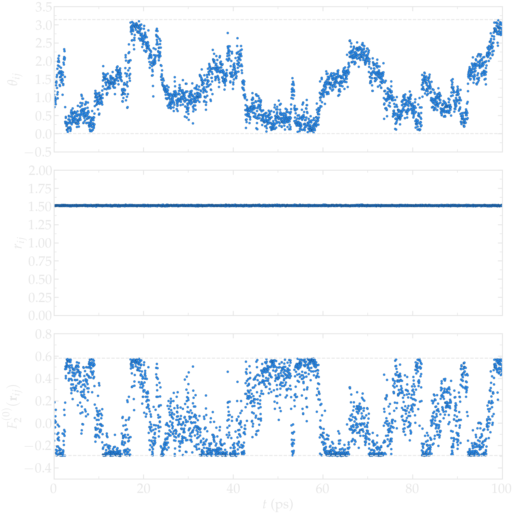
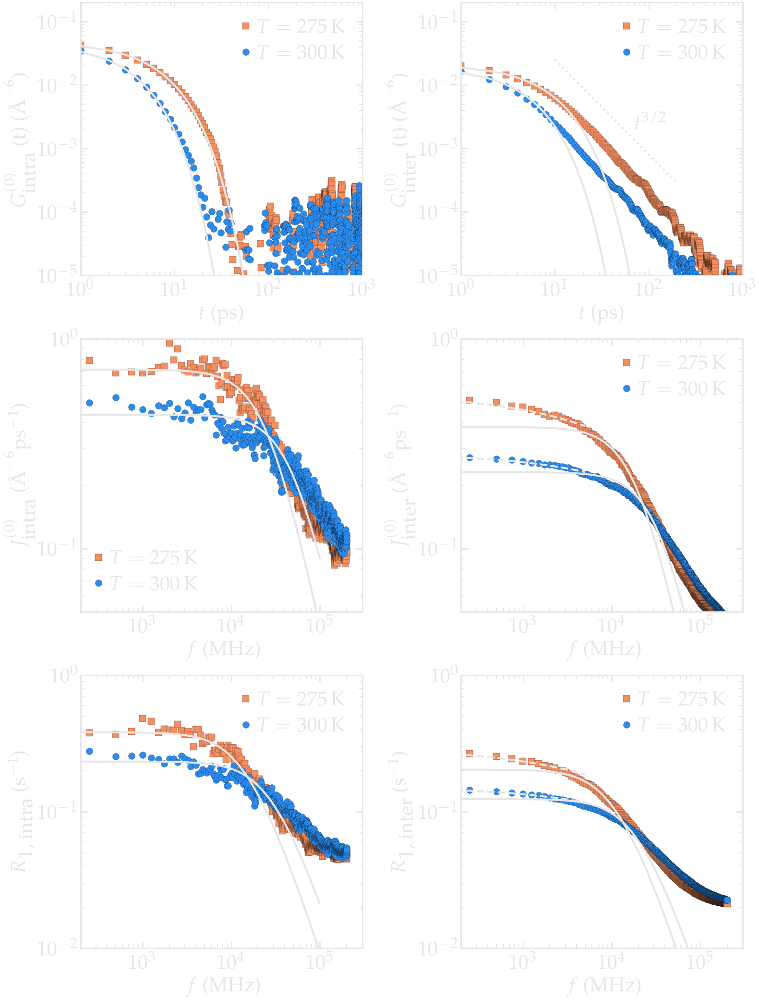
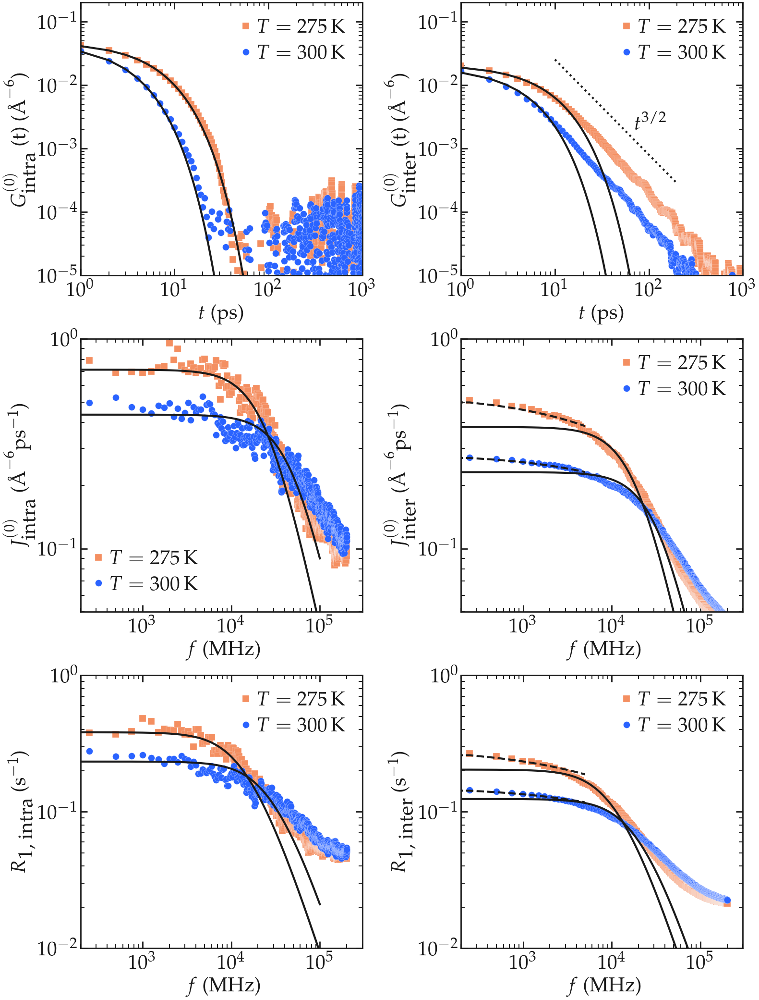

Theory
======

Dipolar relaxation
------------------

.. container:: justify

    When the spin-lattice relaxation is dominated by fluctuations of the magnetic dipole-dipole interaction,
    as is the case for protons in molecular systems, the rates :math:`R_1 (\omega)` and :math:`R_2 (\omega)` are
    related to the spectral densities :math:`J(m)(\omega)` of these fluctuations via the
    Bloembergen-Purcell-Pound (BPP) equations :cite:`bloembergenRelaxationEffectsNuclear1948`:

.. math::
    :label: eq_BPP

    R_1 (\omega) & = & K \left[ J^{(1)} (\omega) + J^{(2)} (2 \omega) \right],

    R_2 (\omega) & = & K \left[ J^{(0)} (0) + 10 J^{(1)} (\omega) + J^{(2)} (2 \omega) \right] / 4,

where

.. math::

    K = \dfrac{3}{2}\left(\dfrac{\mu_0}{4 \pi}\right)^2 \hbar^2 \gamma^4 I (I+1),

.. container:: justify

    where :math:`\mu_0` is the vacuum permeability, :math:`\hbar` the Planck constant (divided by :math:`2 \pi`),
    :math:`\gamma_I` is the gyromagnetic ratio (for ¹H, :math:`I = 1/2` and :math:`\gamma_I = 26.752` rad/T/s,
    for ¹³C, :math:`I = 1/2` and :math:`\gamma_I = 6.728` rad/T/s :cite:`kowalewskiNuclearSpinRelaxation2006`), and
    :math:`I = 1/2` the spin quantum number. The constant :math:`K` has the units of :math:`\text{m}^6/\text{s}^2`.

    The spectral densities :math:`J^{(m)} (\omega)` in Eq. :eq:`eq_BPP` can be obtained as the Fourier transform
    of the autocorrelation functions :math:`G^{(m)}(\tau)`

.. math::

    J^{(m)} (\omega) = \int_0^\infty G^{(m)} (\tau) \cos(\omega \tau) \mathrm d \tau.

.. container:: justify

    The spectral densities are a measure of the distribution of the fluctuations of :math:`G^{(m)}(\tau)`
    among different frequencies, so they provide information on the distribution of the power available
    for causing spin transitions among different frequencies.
    The autocorrelation functions :math:`G^{(m)}(\tau)` read

.. math::

    G^{(m)} (\tau) = \left< F_2^{(m)} [\textbf{r}_{ij} (t)] F_2^{*(m)} [\textbf{r}_{ij} (0)] \right>

.. container:: justify

    where :math:`F_2^{(m)}` are some complex functions of the vector :math:`\textbf{r}_{ij}` between the spin pairs,
    with norm :math:`r_{ij}` and orientation :math:`\Omega_{ij}` with respect to a reference applied magnetic
    field, assumed to be in the :math:`\textbf{e}_z` direction. The functions :math:`F_2^{(m)}` read 

.. math::

    F_2^{(m)} [\textbf{r}_{ij} (t)] = \alpha_m \dfrac{Y_2^{(m)} [\Omega_{ij} (t)]}{r_{ij}^3 (t)}

.. container:: justify

    where :math:`Y_2^{(m)}` are normalized spherical harmonics and
    :math:`\alpha_0^2 = 16 \pi /5`, :math:`\alpha_1^2 = 8 \pi /15`, and :math:`\alpha_2^2 = 32 \pi / 15`.
    Therefore, one can write for the correlation functions:

.. math::

    G^{(m)} (\tau) = \dfrac{\alpha_m^2}{N}
    \sum_i \sum_{j \ne i} \dfrac{Y_2^{(m)} [\Omega_{ij} (0)]}{r_{ij}^3 (0)} \dfrac{Y_2^{*(m)} [\Omega_{ij} (\tau)]}{r_{ij}^3 (\tau)},

.. container:: justify

    where :math:`N` is the number of spins.

Intra/inter contributions
-------------------------

.. container:: justify

    Intra-molecular and inter-molecular contributions to :math:`R_1` and :math:`R_2`
    can be extracted separately, by splitting the correlation functions as:

.. math::

    G^{(m)}_\text{intra} (t) = \dfrac{\alpha_m^2}{N}
    \sum_i \sum_{j \in M_i} \dfrac{Y_2^{(m)} [\Omega_{ij} (0)]}{r_{ij}^3 (0)}
    \dfrac{Y_2^{*(m)} [\Omega_{ij} (\tau)]}{r_{ij}^3 (\tau)},

    G^{(m)}_\text{inter} (t) = \dfrac{\alpha_m^2}{N}
    \sum_i \sum_{j \notin M_i} \dfrac{Y_2^{(m)} [\Omega_{ij} (0)]}{r_{ij}^3 (0)}
    \dfrac{Y_2^{*(m)} [\Omega_{ij} (\tau)]}{r_{ij}^3 (\tau)},

.. container:: justify

    where :math:`j \in M_i` and  :math:`j \notin M_i` refer to summation on spin from the 
    same molecule as :math:`i`, and from different molecules as :math:`i`, respectively.

Isotropic system
----------------

.. container:: justify

    For isotropic system, the correlation functions are proportional to each others, 
    and only :math:`G^{(0)} (t)` needs to be calculated.

    In that case, :math:`G^{(0)} = 6 G^{(1)}`, and :math:`G^{(0)} = 6 / 4 G^{(2)}`
    :cite:`becherMolecularDynamicsSimulations2021`, which can easily be checked, for instance
    for a bulk water system:

.. image:: ../figures/best-practices/proportionality-light.png
    :class: only-light
    :alt: NMR results obtained from the LAMMPS simulation of water

.. container:: justify

    Therefore, the spectrums can be calculated as:

.. math::

    R_1 &=&  \frac{1}{6} \left[ J^{(0)} (\omega_0) + 4 J^{(0)} (2 \omega_0) \right],

    R_2 &=& \frac{1}{6} \left[ J^{(0)} (0) + \frac{5}{2} J^{(0)} (\omega_0) + J^{(0)} (2 \omega_0) \right],

.. container:: justify

    which require less computational time and less memory to achieve, as only 

.. math::

    F_2^{(0)} [\textbf{r}_{ij} (t)] & = & \alpha_m \dfrac{Y_2^{(0)} [\Omega_{ij} (t)]}{r_{ij}^3 (t)}

    & = & \dfrac{3 \cos^2 \theta_\text{ij} (t) - 1}{r_{ij}^3 (t)}

.. container:: justify

    needs to be evaluated.

Illustration
------------

Let us first visualise how :math:`r_{ij}` and :math:`\Omega_{ij}` evolve with time in the case of a 
bulk water simulation. For comparison, two simulations were performed at 300 K and 275 K, respectively.
First, look at the intramolecular motion within a single (rigid) water molecule. As expected, the 
average distance :math:`r_{ij}` between the two hydrogens atoms within the same molecule remains
constant (within the uncertainty of the shake algorithm used to maintain the water molecule rigid),
while the polar angle :math:`\theta_{ij}` fluctuates due to the molecule rotating. Following the 
fluctuations of :math:`\theta_{ij}`, the function :math:`F_{0}^{(2)}` fluctuates with time 
between the bounds given by :math:`(3 \cos^2 0 - 1 ) / a^3 = 2 / a^3 \approx 0.58\,A^{-3}`,
where :math:`a \approx 1.51\,A` is the distance between the two hydrogen atoms of the water
molecule, and :math:`(3 \cos^2 \pi/2 - 1 ) / a^3 = -1 / a^3 \approx -0.29\,\,A^{-3}`.

.. image:: ../figures/best-practices/intramolecular-signal-illustration-light.png
    :class: only-light
    :alt: NMR results obtained from the LAMMPS simulation of water

Second, let us look at the intermolecular motion between two hydrogen atoms from two different
molecules. In that case, :math:`r_{ij}` fluctuates significantly between $\approx 2.5 A$, for when 
molecules are next to one another, to larger values (as large as the box allows). The functions
:math:`F_{0}^{(2)}` reaches its largest values when :math:`r_{ij}` is the shorter.

.. image:: ../figures/best-practices/intermolecular-signal-illustration-dark.png
    :class: only-dark
    :alt: NMR results obtained from the LAMMPS simulation of water

.. image:: ../figures/best-practices/intermolecular-signal-illustration-light.png
    :class: only-light
    :alt: NMR results obtained from the LAMMPS simulation of water

From the fluctuating quantities :math:`F_{0}^{(2)}` summed up over all the pair of 
spins, one can extract correlation functions :math:`G_\textrm{intra}^{(0)}` and
:math:`G_\textrm{inter}^{(0)}`. Here, the intra-molecular correlation functions are reasonably 
adjusted for $t < 40$ ps by 

.. math::
    :label: eq_exp_G

    G_\text{intra} (t) = G_\text{intra} (0)  \exp{-t / \tau_\text{c}}

using :math:`\tau_\text{c} = 6.3` ps for :math:`T = 300` K 
and :math:`\tau_\text{c} = 3.2` ps for :math:`T = 275` K. The inter-molecular correlation
functions, however, scale as an exponential [Eq. :eq:`eq_exp_G`] only for the shorter times,
probably corresponding to the desorption event ofs the atom/molecule i desorbing from j,
but scale as :math:`G_\text{inter} (t) \sim t^{3/2}` for larger time, which is a 
characteristic signature of diffusion, which controls the return of the neighbor molecules.

The intra molecular spectrum :math:`J_\textrm{intra}^{(0)}` can be adjusted by a Lorentzian

.. math::
    :label: eq_lorenzian_G

    J_\text{intra} (t) = G_\text{intra} (0) \dfrac{2 \tau_\text{c}}{1 + \omega^2 \tau_\text{c}^2}