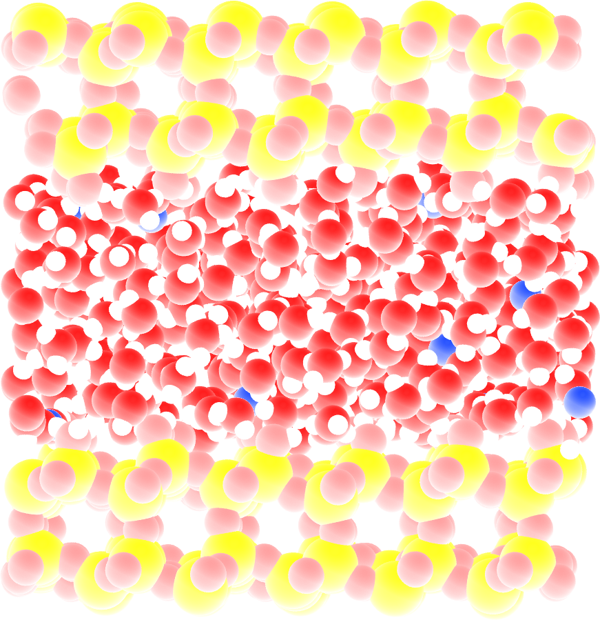
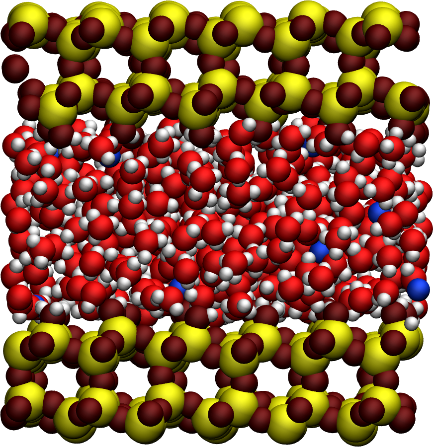
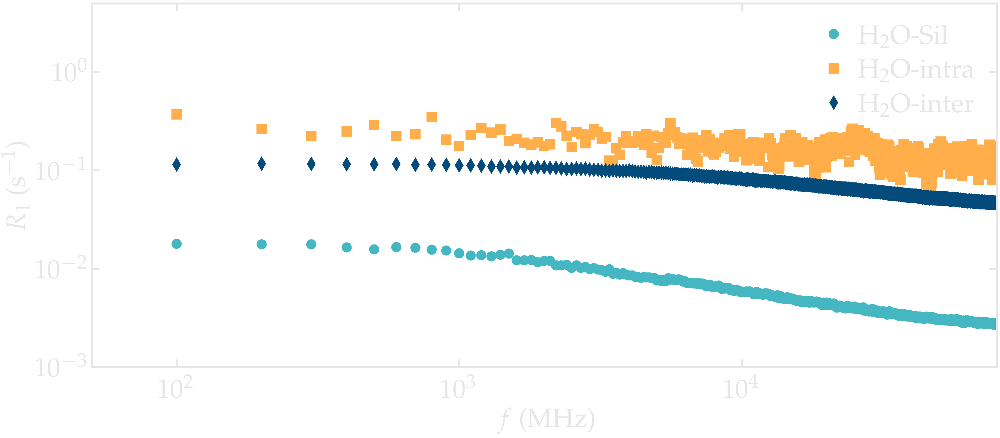
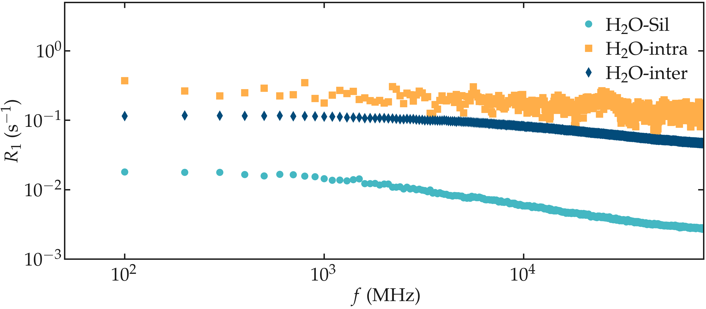

.. _anisotropic-label:

Anisotropic systems
===================

.. container:: justify

    In this tutorial, the NMR relaxation rate :math:`R_1`
    is measured from water confined in a nanoslit os silica.

.. container:: justify

    I recommend you to follow
    this tutorial on a simpler :ref:`isotropic-label` first.

MD system
---------

.. container:: hatnote

   Measuring the NMR relaxation time of nanoconfined water

.. container:: justify

    The system is made of 602 :math:`\text{TIP4P}-\epsilon` water molecules
    in a slit silica nanopore. The trajectory was recorded
    during a :math:`10\,\text{ns}` production run performed with the open source code GROMACS
    in the anisotropic NPzT ensemble using a timestep of :math:`1\,\text{fs}`.
    In order to balance the charge of the surface, 20 sodium ions are
    present in the slit.
    The imposed was temperature :math:`T = 300\,^\circ\text{K}`, and the pressure
    :math:`p = 1\,\text{bar}`. The positions of the atoms were recorded in
    the *prod.xtc* file
    every :math:`2\,\text{ps}`.
    
.. container:: justify

    You can access all the simulation files
    and trajectories in this separate Github |repository-examples|.

.. |repository-examples| raw:: html

   <a href="https://github.com/simongravelle/nmrformd-data" target="_blank">repository</a>

.. container:: justify

    If you are not familiar with GROMACS, you can find |gromacs-tutorials| here.

.. |gromacs-tutorials| raw:: html

   <a href="https://gromacstutorials.github.io/" target="_blank">tutorials</a>

File preparation
----------------

.. container:: justify

    To access all trajectory files, simply clone
    the *NMRforMD* repository with its submodule:

.. code-block:: bash

    git clone --recurse-submodules https://github.com/simongravelle/nmrformd.git

.. container:: justify

    Here the secondary repository *nmrformd-data* is imported as
    as submodule. The dataset needed to follow this tutorial is located
    in *nmrformd-data/water-in-silica/raw-data/N50/.

Create a MDAnalysis universe
----------------------------

.. container:: justify

    Open a new Python script or a new notebook, and define
    the path to the data files:

.. code-block:: python

	datapath = "mypath/nmrformd-data/water-in-silica/raw-data/N50/"

.. |repository| raw:: html

   <a href="https://github.com/simongravelle/nmrformd/tree/main/tests" target="_blank">repository</a>

.. container:: justify

    Then, import numpy, MDAnalysis, and NMRforMD:

.. code-block:: python

	import numpy as np
	import MDAnalysis as mda
	import nmrformd as nmrmd

.. container:: justify

    From the trajectory files, let us create a MDAnalysis universe.
    Import the configuration file and the trajectory:

.. code-block:: python

    u = mda.Universe(datapath+"prod.tpr", datapath+"prod.xtc")

.. container:: justify

    Let us extract a few information from the universe,
    such as number of molecules, timestep, and total duration:

.. code-block:: python

    n_molecules = u.atoms.n_residues
    print(f"The number of molecules is {n_molecules}")
    timestep = np.int32(u.trajectory.dt)
    print(f"The timestep is {timestep} ps")
    total_time = np.int32(u.trajectory.totaltime)
    print(f"The total simulation time is {total_time} ps")

.. code-block:: bw

    >> The number of molecules is 623
    >> The timestep is 2 ps
    >> The total simulation time is 10000 ps

Launch the NMR analysis
-----------------------

.. container:: justify

    Let us create 3 atoms groups for respectively the hydrogen
    atoms of the silica, the hydrogen
    atoms of the water, and all the hydrogen atoms:

.. code-block:: python

    H_H2O = u.select_atoms("name HW1 HW2")
    H_SIL = u.select_atoms("name H")
    H_ALL = H_H2O + H_SIL

.. container:: justify

    Then, let us run 3 separate NMR analyses, one for the 
    water-silica interaction only, one for the intra-molecular
    interaction of water, and one for the inter-molecular inter-molecular interaction
    of water:

.. code-block:: python

    nmr_H2O_SIL = nmrmd.NMR(u, atom_group = H_H2O,
                        neighbor_group = H_SIL, number_i=40, isotropic=False)
    nmr_H2O_INTRA = nmrmd.NMR(u, atom_group = H_H2O, neighbor_group = H_H2O, number_i=40,
                            type_analysis = 'intra_molecular', isotropic=False)
    nmr_H2O_INTER = nmrmd.NMR(u, atom_group = H_H2O, neighbor_group = H_H2O, number_i=40,
                            type_analysis = 'inter_molecular', isotropic=False)

.. container:: justify

    Note the use of *isotropic = False*, which is necessary here since the
    system is non-isotropic.

Extract the NMR spectra
-----------------------

.. container:: justify

    Let us access the NMR relaxation rate :math:`R_1`:

.. code-block:: python

    R1_spectrum_H2O_SIL = nmr_H2O_SIL.R1
    R1_spectrum_H2O_INTRA = nmr_H2O_INTRA.R1
    R1_spectrum_H2O_INTER = nmr_H2O_INTER.R1
    f = nmr_H2O_SIL.f

.. container:: justify

    The 3 spectra :math:`R_1` can be
    plotted as a function of :math:`f` using pyplot.

.. code-block:: python

    from matplotlib import pyplot as plt
    plt.loglog(f, R1_spectrum_H2O_SIL, 'o')
    plt.loglog(f, R1_spectrum_H2O_INTRA, 's')
    plt.loglog(f, R1_spectrum_H2O_INTER, 'd')
    plt.show()

.. container:: figurelegend

    Figure: NMR relaxation rates :math:`R_1` for the water confined in
    a silica slit.

.. container:: justify

    Note that the :math:`\text{H}_2\text{O}-\text{silica}` contribution is 
    much smaller than the intra and inter molecular contribution from the
    water. This can be explained by the comparatively small number of hydrogen
    atoms from the silica: 92, compared to the 1204 hydrogen atoms from the water.