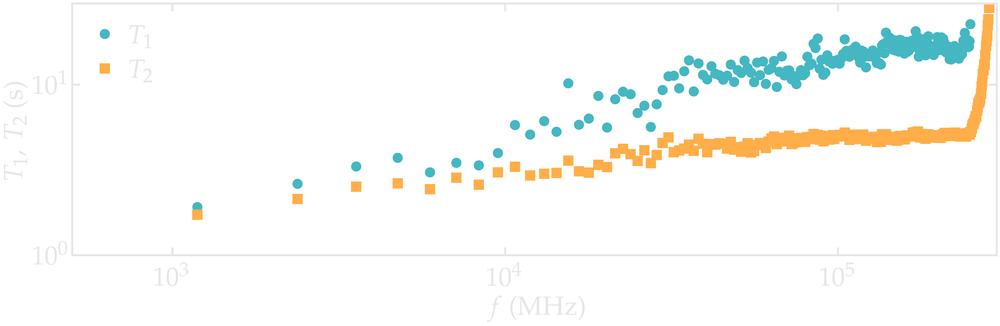
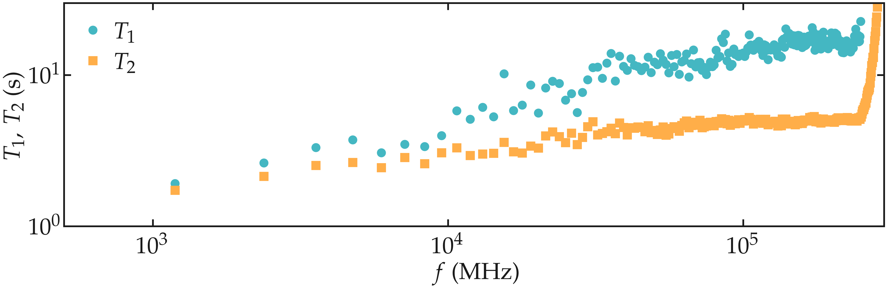

.. _anisotropic-label:

Anisotropic systems
===================

.. container:: hatnote

   Measuring the NMR relaxation time of nanoconfined water

.. container:: justify

    In this tutorial, the NMR relaxation times :math:`T_1` and :math:`T_2`
    are measured from water confined in a nanoslit os silica.

.. container:: justify

    I recommend you to follow
    this tutorial on a simpler :ref:`isotropic-label` first.

MD system
---------

.. container:: justify

    The system is made of 602 :math:`\text{TIP4P}-\epsilon` water molecules
    in a slit silica nanopore. The trajectory was recorded
    during a :math:`10\,\text{ns}` production run performed with the open source code GROMACS
    in the anisotropic NPzT ensemble using a timestep of :math:`1\,\text{fs}`.
    The imposed was temperature :math:`T = 300\,^\circ\text{K}`, and the pressure
    :math:`p = 1\,\text{bar}`. The positions of the atoms were recorded in
    the *prod.xtc* file
    every :math:`2\,\text{ps}`.
    
.. container:: justify

    You can access all the simulation files
    and trajectories in this separate Github |repository-examples|.

.. |repository-examples| raw:: html

   <a href="https://github.com/simongravelle/nmrformd-data" target="_blank">repository</a>

.. container:: justify

    If you are not familiar with GROMACS, you can find |gromacs-tutorials| here.

.. |gromacs-tutorials| raw:: html

   <a href="https://gromacstutorials.github.io/" target="_blank">tutorials</a>

File preparation
----------------

.. container:: justify

    To access all trajectory files, simply clone
    the *NMRforMD* repository with its submodule:

.. code-block:: bash

    git clone --recurse-submodules https://github.com/simongravelle/nmrformd.git

.. container:: justify

    Here the secondary repository *nmrformd-data* is imported as
    as submodule. The dataset needed to follow this tutorial is located
    in *nmrformd-data/water-in-silica/raw-data/N50/.

Create a MDAnalysis universe
----------------------------

.. container:: justify

    Open a new Python script or a new notebook, and define
    the path to the data files:

.. code-block:: python

	datapath = "mypath/nmrformd-data/water-in-silica/raw-data/N50/"

.. |repository| raw:: html

   <a href="ttps://github.com/simongravelle/nmrformd/tree/main/tests" target="_blank">repository</a>

.. container:: justify

    Then, import numpy, MDAnalysis, and NMRforMD:

.. code-block:: python

	import numpy as np
	import MDAnalysis as mda
	import nmrformd as nmrmd

.. container:: justify

    From the trajectory files, let us create a MDAnalysis universe.
    Import the configuration file and the trajectory:

.. code-block:: python

    u = mda.Universe(datapath+"prod.tpr", datapath+"prod.xtc")

.. container:: justify

    Let us extract a few information from the universe,
    such as number of molecules, timestep, and total duration:

.. code-block:: python

    n_molecules = u.atoms.n_residues
    print(f"The number of molecules is {n_molecules}")
    timestep = np.int32(u.trajectory.dt)
    print(f"The timestep is {timestep} ps")
    total_time = np.int32(u.trajectory.totaltime)
    print(f"The total simulation time is {total_time} ps")

.. code-block:: bw

    >> The number of molecules is 623
    >> The timestep is 2 ps
    >> The total simulation time is 10000 ps

Launch the NMR analysis
-----------------------

.. container:: justify

    Let us create 3 atoms for the hydrogen atoms of the PEG, the hydrogen
    atoms of the water, and all the hydrogen atoms:

.. code-block:: python

    H_PEG = u.select_atoms("type 3 5")
    H_H2O = u.select_atoms("type 7")
    H_ALL = H_PEG + H_H2O

.. container:: justify

    Then, let us run NMRforMD for all the hydrogen atoms:

.. code-block:: python

	nmr_ALL = nmrmd.NMR(u, atom_group = H_ALL, neighbor_group = H_ALL, number_i=40)

.. container:: justify

    With 'number_i = 40', only 40 randomly selected atoms within 'H_ALL' are
    considered for the calculation. Increase this number for better resolution,
    and use 'number_i = 0' to consider all the atoms.

Extract the NMR spectra
-----------------------

.. container:: justify

    Let us access the calculated value of the NMR relaxation time :math:`T_1`:

.. code-block:: python

    T1 = np.round(nmr_ALL.T1,2)
    print(f"The total NMR relaxation time is T1 = {T1} s")

.. code-block:: bw

    >> NMR relaxation time T1 = 2.53 s

..  container:: justify

    The value you obtain may vary, depending on which hydrogen atoms
    were randomly selected for the calculation.

..  container:: justify

    The full :math:`T_1` and :math:`T_2` spectra can be extracted as well
    as 1/nmr_ALL.R1 and 1/nmr_ALL.R2, respectively,
    and the corresponding frequency is given by nmr_ALL.f.

.. code-block:: python

    R1_spectrum = nmr_ALL.R1
    R2_spectrum = nmr_ALL.R2
    T1_spectrum = 1/R1_spectrum
    T2_spectrum = 1/R2_spectrum
    f = nmr_ALL.f

..  container:: justify

    The spectra :math:`T_1` and :math:`T_2` can then be
    plotted as a function of :math:`f` using pyplot.

.. code-block:: python

    from matplotlib import pyplot as plt
    plt.loglog(f, T1_spectrum, 'o')
    plt.loglog(f, T2_spectrum, 's')
    plt.show()

.. container:: figurelegend

    Figure: NMR relaxation times :math:`T_1` (disks) and 
    :math:`T_2` (squares) as a function
    of the frequency :math:`f` for
    the :math:`\text{PEG-H}_2\text{O}` bulk mixture.

Calculate the intra-molecular NMR relaxation
--------------------------------------------

..  container:: justify

    Let us measuring the intra-molecular contribution to the NMR
    relaxation time measurement. To make the analysis easier,
    let us also differentiate between PEG and :math:`\text{H}_2\text{O}`
    molecule, and perform 2 separate analyses.

.. code-block:: python

    nmr_H2O_intra = nmrmd.NMR(u, atom_group = H_H2O, type_analysis="intra_molecular", number_i=40)
    nmr_PEG_intra = nmrmd.NMR(u, atom_group = H_PEG, type_analysis="intra_molecular", number_i=40)

..  container:: justify

    The correlation function Gij can be accessed from nmr_H2O_intra.gij[0],
    and the time  from nmr_H2O_intra.t.

.. code-block:: python

    t = nmr_PEG_intra.t
    G_intra_H2O = nmr_H2O_intra.gij[0]
    G_intra_PEG = nmr_PEG_intra.gij[0]

.. image:: ../figures/tutorials/isotropic-systems/Gintra-dark.png
    :class: only-dark
    :alt: NMR results obtained from the LAMMPS simulation of water-PEG

.. image:: ../figures/tutorials/isotropic-systems/Gintra-light.png
    :class: only-light
    :alt: NMR results obtained from the LAMMPS simulation of water-PEG

.. container:: figurelegend

    Figure: Intra-molecular correlation function :math:`G_\text{R}`
    for both PEG (squares) and :math:`\text{H}_2\text{O}` (disks).

..  container:: justify

    From the correlation functions, one can obtain the typical
    rotational time of the molecules.

.. code-block:: python

    tau_rot_H2O = np.round(np.trapz(G_intra_H2O, t)/G_intra_H2O[0],2)
    tau_rot_PEG = np.round(np.trapz(G_intra_PEG, t)/G_intra_PEG[0],2)
    print(f"The rotational time of H2O is = {tau_rot_H2O} ps")
    print(f"The rotational time of PEG is = {tau_rot_PEG} ps")

.. code-block:: bw

    >> The rotational time of H2O is = 6.35 ps
    >> The rotational time of PEG is = 8.34 ps