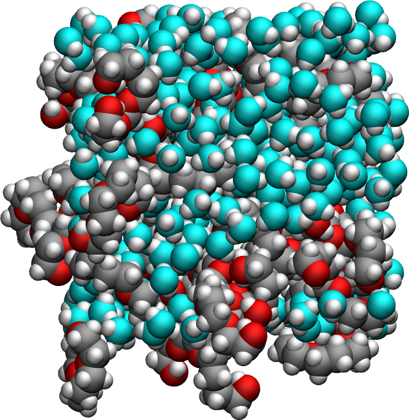

Isotropic systems
=================

.. container:: hatnote

   Measuring the NMR relaxation time from a bulk water-polymer mixture

.. container:: justify

    In this tutorial, the NMR relaxation times :math:`T_1` and :math:`T_2`
    are measured from a bulk polymer-water mixture using |NMRforMD|.
    To follow the tutorial, |MDAnalysis|,
    |numpy|, and
    |matplotlib| must be installed.

.. |NMRforMD| raw:: html

   <a href="https://nmrformd.readthedocs.io" target="_blank">NMRforMD</a>

.. |MDAnalysis| raw:: html

   <a href="https://www.mdanalysis.org" target="_blank">MDAnalysis</a>

.. |numpy| raw:: html

   <a href="https://www.numpy.org" target="_blank">numpy</a>

.. |matplotlib| raw:: html

   <a href="https://www.matplotlib.org" target="_blank">matplotlib</a>

.. image:: ../figures/tutorials/polymer-in-water/peg-dark.png
    :class: only-dark
    :alt: PEG-water mixture simulated with GROMACS - Dipolar NMR relaxation time calculation
    :width: 250
    :align: right

MD system
---------

.. container:: justify

    The system is made of a bulk mixture of 320 :math:`\text{TIP4P}-\epsilon` water molecules
    and 32 :math:`\text{PEG}300` polymer molecules. The trajectory was recorded
    during a :math:`10\,\text{ns}` production run performed with the open source code LAMMPS
    in the NPT ensemble using a timestep of :math:`1\,\text{fs}`.
    The imposed was temperature :math:`T = 300\,^\circ\text{K}`, and the pressure
    :math:`p = 1\,\text{atm}`. The positions of the atoms were recorded in
    the *prod.xtc* file
    every :math:`1\,\text{ps}`.
    
.. container:: justify

    You can access all the simulation files
    and trajectories in this separate Github |repository-examples|.

.. |repository-examples| raw:: html

   <a href="https://github.com/simongravelle/nmrformd-data" target="_blank">repository</a>

.. container:: justify

    If you are not familiar with LAMMPS, you can find |lammps-tutorials| here.

.. |lammps-tutorials| raw:: html

   <a href="https://lammpstutorials.github.io/" target="_blank">tutorials</a>

File preparation
----------------

.. container:: justify

    To access all trajectory files, simply clone
    the *NMRforMD* repository with its submodule:

.. code-block:: bash

    git clone --recurse-submodules https://github.com/simongravelle/nmrformd.git

.. container:: justify

    Here the secondary repository *nmrformd-data* is imported as
    as submodule. The dataset needed to follow this tutorial is located
    in *nmrformd-data/polymer-in-water/raw-data/NPEG32/*.

Create a MDAnalysis universe
----------------------------

.. container:: justify

    Open a new Python script or a new notebook, and define
    the path to the data files:

.. code-block:: python

	datapath = "mypath/nmrformd-data/polymer-in-water/raw-data/NPEG32/"

.. |repository| raw:: html

   <a href="ttps://github.com/simongravelle/nmrformd/tree/main/tests" target="_blank">repository</a>

.. container:: justify

    Then, import numpy, MDAnalysis, and NMRforMD:

.. code-block:: python

	import numpy as np
	import MDAnalysis as mda
	import nmrformd as nmrmd

.. container:: justify

    From the trajectory files, let us create a MDAnalysis universe.
    Import the configuration file and the trajectory:

.. code-block:: python

    u = mda.Universe(datapath+"topology.data", datapath+"traj.xtc")
    u.transfer_to_memory(stop=501)

.. container:: justify

    The *u.transfer_to_memory(stop=501)*, is optional, it only serve to 
    reduce the number of frames, and therefore reduce the duration of 
    the calculation. Feel free to remove it, or increase its value.

.. container:: justify

    Note : the figures here have been generated using the 
    full trajectory (i.e. without the *transfer_to_memory* command).

.. container:: justify

    The MDAnalysis universe *u* contains both topology (atoms types, masses, etc.)
    and trajectory (atom positions at every frame).

.. container:: justify

    Let us extract a few information from the universe, such as number of molecules,
    timestep, and total duration:

.. code-block:: python

	n_molecules = u.atoms.n_residues
	print(f"The number of water molecules is {n_molecules}")

.. code-block:: bash

    >> The number of water molecules is 398

.. code-block:: python

	timestep = np.int32(u.trajectory.dt)
	print(f"The timestep is {timestep} ps")

.. code-block:: bash

    >> The timestep is 1 ps

.. code-block:: python

	total_time = np.int32(u.trajectory.totaltime)
	print(f"The total simulation time is {total_time} ps")

.. code-block:: bash

    >> The total simulation time is 500 ps

.. container:: justify

    Note that in the context of MDAnalysis,
    the *timestep* refers to the duration
    between two recorded frames, which is different from the actual
    timestep of :math:`1\,\text{fs}` used for the LAMMPS
    molecular dynamics simulation.

Run NMRforMD
------------

.. container:: justify

    Let us isolate a group of atoms containing all the hydrogen atoms (i.e. atoms of 
    type 2) of the system:

.. code-block:: python

	group_i = u.select_atoms("type 2")

.. container:: justify

    Then, let us run NMRforMD, using the same group as i and j types:

.. code-block:: python

	nmr_result = nmrmd.NMR(u, group_i, number_i=40)

.. container:: justify

    With 'number_i = 40', only 40 randomly selected atoms within 'group_i' are considered for the calculation.
    Increase this number for better resolution. Use 'number_i = 0' to consider all the atoms.

Extract results
---------------

.. container:: justify

    Let us access the calculated value of the NMR relaxation time T1:

.. code-block:: python

	T1 = np.round(nmr_result.T1,2)
	print(f"NMR relaxation time T1 = {T1} s")

.. code-block:: bash

    >> NMR relaxation time T1 = 3.08 s

..  container:: justify

    The value you obtain may vary, depending on which hydrogen atoms
    were randomly selected by NMRforMD.

    The T1 spectrum can be extracted as 1/nmr_result.R1 (i.e. the invert of R1),
    and the corresponding frequency is given by nmr_result.f. Let up plot
    T1 as a function of f:

..  container:: justify

    The correlation function Gij can be accessed from nmr_result.gij[0], and the time 
    from nmr_result.t. Let us plot Gij as a function of t:

Intra vs inter-molecular
------------------------

..  container:: justify

    Let us calculate the intra-molecular and inter-molecular contributions to the
    NMR spectrum R1 by calling NMRforMD twice:

.. code-block:: python

    nmr_result_intra = nmrmd.NMR(u, group_i, type_analysis="intra_molecular", number_i=40)
    nmr_result_inter = nmrmd.NMR(u, group_i, type_analysis="inter_molecular", number_i=20)

..  container:: justify

    Note that the intra_molecular contribution is always more noisy than the inter_molecular,
    which is why more atoms were included in the analysis.
    We can plot both intra-molecular and inter-molecular contributions separately:

..  container:: justify

    It appears that the intra-molecular contribution is the dominant one,
    which is expected for bulk water. We can also look at the 
    correlation functions:

..  container:: justify

    Another expected result: the inter-molecular contribution,
    which is typically associated with the translational 
    motion of the molecules, has longer characteristic times
    than the intra-contribution, which is typically associated to the 
    rotation of the molecules. 
