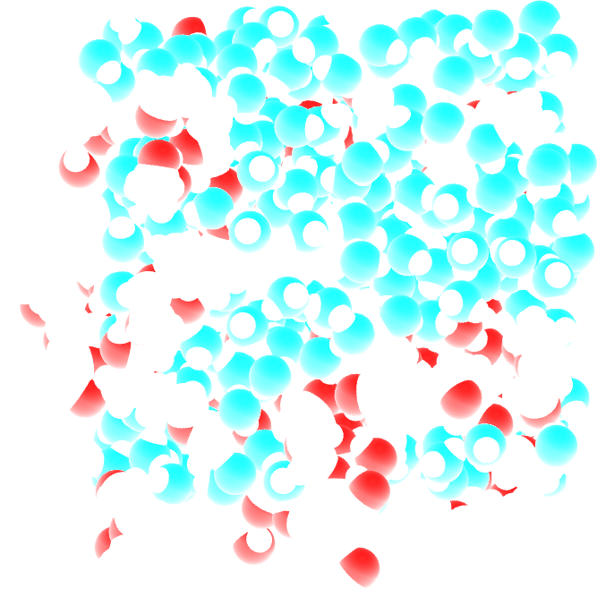

Solvated polymer
================

.. container:: hatnote

   Dealing with multiple groups

.. image:: ../figures/tutorials/polymer-in-water/peg-light.png
    :class: only-light
    :alt: PEG-water mixture simulated with gromacs - NMR relaxation time calculation
    :width: 350
    :align: right

.. container:: justify

    In this tutorial, the NMR relaxation time :math:`T_1` of a water-polymer (PEG) is measured using
    NMRforMD. Make sure you followed the 'bulk water' tutorial first.

    The system is made of 334 TIP4P water molecules and 20 PEG300 polymer molecules
    simulated in the NVT ensemble with GROMACS at a temperature of 295.15°K. The total
    duration of the simulation is 5\,ns, and the timestep is 1 fs. You can
    access the input files in this
    `repository <https://github.com/simongravelle/nmrformd/tree/main/examples>`__,
    which you can use to create larger system or longer trajectory. If
    you are not familiar with GROMACS, you can find `tutorials
    here <https://gromacstutorials.github.io/>`__.

File preparation
----------------

.. container:: justify

    Either download the files from the Github |repository|, or clone
    the NMRforMD repository:

.. code-block:: bash

    git clone git@github.com:simongravelle/nmrformd.git

.. container:: justify

    The datasets are located in 'examples/raw-data/polymer-in-water/N17/'.

    Open a Python script or a Jupyter notebook, and define
    the path to the data files:

.. code-block:: python

	datapath = "../../raw-data/polymer-in-water/N17/"

.. |repository| raw:: html

   <a href="ttps://github.com/simongravelle/nmrformd/tree/main/tests" target="_blank">repository</a>

Import the libraries
--------------------

.. container:: justify

    Import numpy, MDAnalysis, and NMRforMD:

.. code-block:: python

	import numpy as np
	import MDAnalysis as mda
	import nmrformd as nmrmd

Create a MDAnalysis universe
----------------------------

.. container:: justify

    Import the configuration file and the trajectory:

.. code-block:: python

	u = mda.Universe(datapath+"prod.tpr", datapath+"prod.xtc")

.. container:: justify

    Let us define . groups containing the hydrogen atoms, and 
    the hydrogen atoms of water and the PEG polymer:

.. code-block:: python

    group_H = u.select_atoms("type H*")
    group_H_water = u.select_atoms("resname SOL and type H*")
    group_H_polymer = u.select_atoms("resname PEG and type H*")

.. container:: justify

    Let us extract the number of water and PEG molecules:

.. code-block:: python

    n_water_molecules = group_water.n_residues
    print(f"The number of water molecules is {n_water_molecules}")
    n_polymer_molecules = group_polymer.n_residues
    print(f"The number of PEG molecules is {n_polymer_molecules}")

.. code-block:: bash

    >> The number of water molecules is 334
    >> The number of PEG molecules is 20

Run NMRforMD
------------

..  container:: justify

    Then, let us run NMRforMD, using the PEG hydrogen (group group_H_polymer) as subject i group,
    and all the hydrogen atoms (water + PEG) as potential neighbors. 

.. code-block:: python

    PEG_nmr = nmrmd.NMR(u, group_H_polymer, neighbor_group=group_H, number_i=17)
    H2O_nmr = nmrmd.NMR(u, group_H_water, neighbor_group=group_H, number_i=82)

..  container:: justify

    The calculation with take a few minutes. Use smaller values of *number_i* for faster results.

Extract T1
----------

..  container:: justify

    Let us access the calculated value of the NMR relaxation time T1, for both PEG and H2O:

.. code-block:: python

    T1_PEG = np.round(PEG_nmr.T1,2)
    print(f"NMR relaxation time T1 - PEG = {T1_PEG} s")
    T1_H2O = np.round(H2O_nmr.T1,2)
    print(f"NMR relaxation time T1 - H2O = {T1_H2O} s")

.. code-block:: bash

    >> NMR relaxation time T1 - PEG = 1.64 s
    >> NMR relaxation time T1 - H2O = 4.05 s

..  container:: justify

    The values you get may vary a little, depending on which hydrogen atoms
    were randomly selected by NMRforMD. Increase the value of *number_i* for
    more accurate results.

Plot the spectrum
-----------------

..  container:: justify

    The R1 (R1 = 1/T1) spectrum can be extracted as nmr_result.R1,
    and the corresponding frequency is given by nmr_result.f. Let up plot
    R1 as a function of f:

..  container:: justify

    Figure: NMR relaxation rate R1 for water and polymer PEG as a function of the frequency.
    Noise can be reduced by increasing *number_i*.

Plot the correlation functions
------------------------------

..  container:: justify

    The correlation function Gij can be accessed from nmr_result.gij[0], and the time 
    from nmr_result.t. Let us plot Gij as a function of t:

..  container:: justify

    Figure: Correlation functions Gij for both water and PEG. Water show
    shorter characteristic time, which is expected for smaller molecules. 
