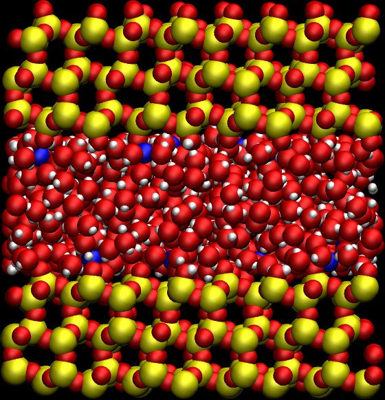
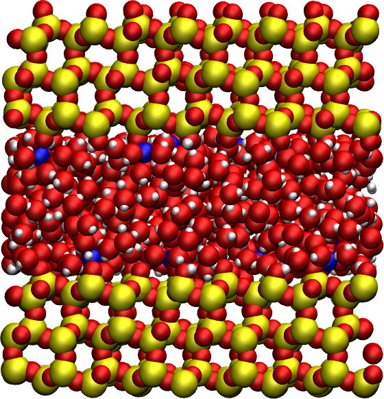
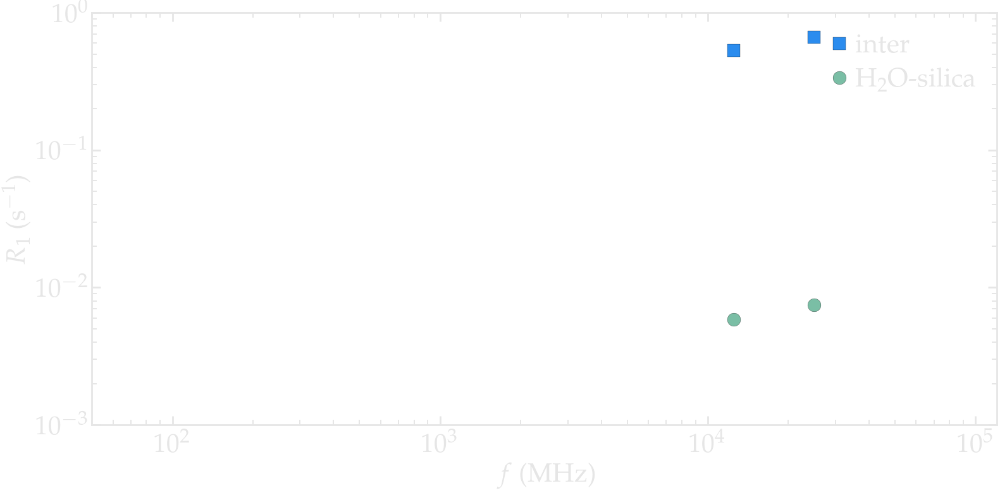
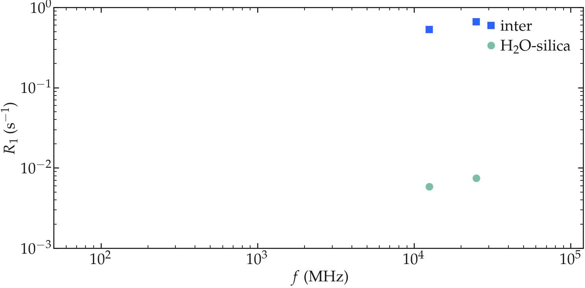
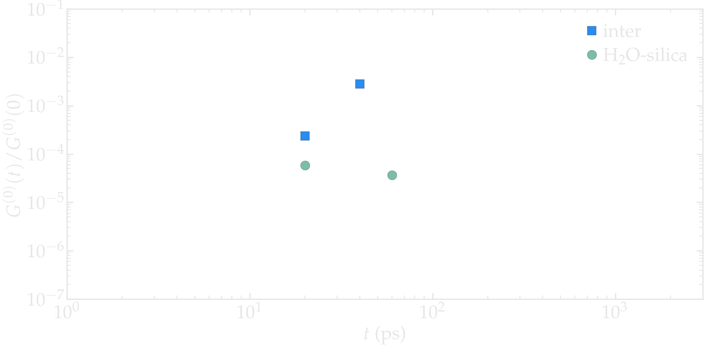
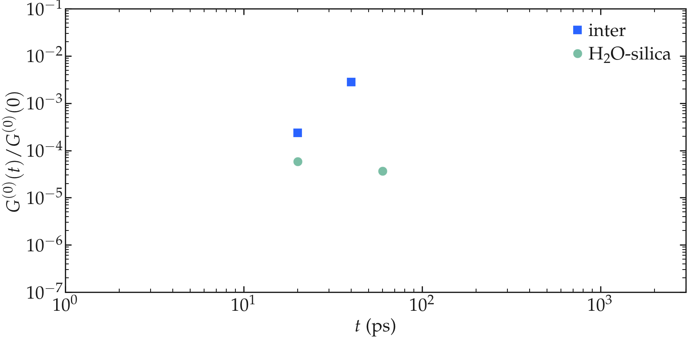
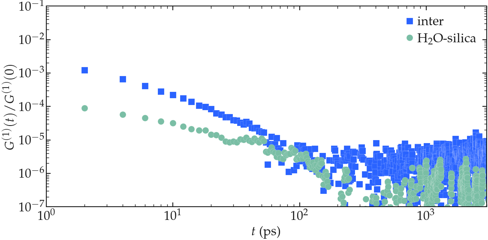
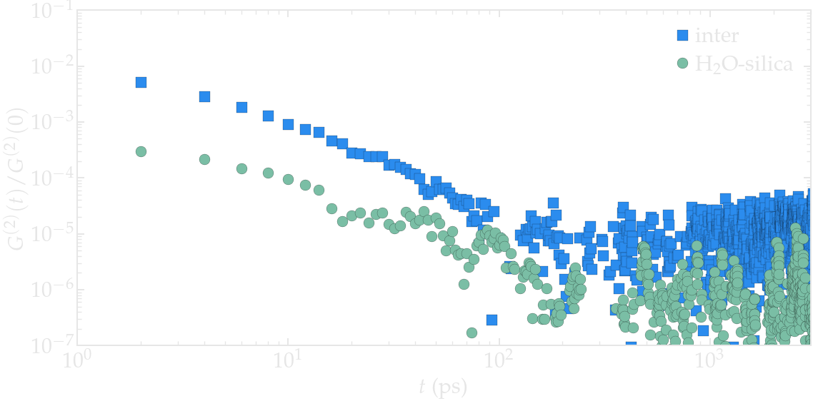
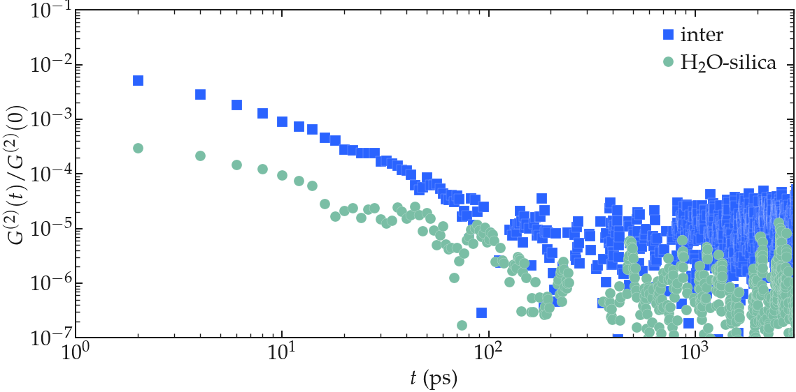

Water in silica
===============

.. container:: hatnote

   The case of anisotropic systems

.. container:: justify

    In this tutorial, the NMR relaxation time :math:`T_1` of water confined 
    within a slit nanopore is measured using
    NMRforMD. Make sure you followed the 'bulk water' tutorial first.

    The system is made of 592 TIP4P water molecules and 20 sodium counter ion (Na+)
    simulated with GROMACS at a temperature of 300 K. The total
    duration of the simulation is 20\,ns, and the timestep is 1 fs. You can
    access the input files in this
    `repository <https://github.com/simongravelle/nmrformd/tree/main/examples>`__,
    which you can use to create larger system or longer trajectory. If
    you are not familiar with GROMACS, you can find `tutorials
    here <https://gromacstutorials.github.io/>`__.

File preparation
----------------

.. container:: justify

    Either download the files from the Github |repository|, or clone
    the NMRforMD repository:

.. code-block:: bash

    git clone git@github.com:simongravelle/nmrformd.git

.. container:: justify

    The data are located in 'examples/polymer-in-water/gromacs-inputs/'.

    Open a Python script or a Jupyter notebook, and define
    the path to the data files:

.. code-block:: python

	datapath = "../../raw-data/water-in-silica/N50/"

.. |repository| raw:: html

   <a href="ttps://github.com/simongravelle/nmrformd/tree/main/tests" target="_blank">repository</a>

Import the libraries
--------------------

.. container:: justify

    Import numpy, MDAnalysis, and NMRforMD:

.. code-block:: python

	import numpy as np
	import MDAnalysis as mda
	import nmrformd as nmrmd

Create a MDAnalysis universe
----------------------------

.. container:: justify

    Import the configuration file and the trajectory:

.. code-block:: python

	u = mda.Universe(datapath+"prod.tpr", datapath+"prod.xtc")

.. container:: justify

    Let us define groups containing all the hydrogen atoms, and 
    the hydrogen atoms of water, and the hydrogen atoms of the silica (the -OH groups):

.. code-block:: python

    group_H = u.select_atoms("type H*")
    group_H_water = u.select_atoms("resname SOL and type H*")
    group_H_silica = u.select_atoms("resname SiOH and type H*")

.. container:: justify

    Let us extract the number of water molecules:

.. code-block:: python

    n_water_molecules = group_H_water.n_residues
    print(f"The number of water molecules is {n_water_molecules}")

.. code-block:: bash

    >> The number of water molecules is 594

Run NMRforMD
------------

..  container:: justify

    Then, let us run NMRforMD: 

.. code-block:: python

    TOTAL_nmr = nmrmd.NMR(u, group_H_water, neighbor_group=group_H, number_i=50, isotropic=False)
    H2O_SILICA_nmr = nmrmd.NMR(u, group_H_water, neighbor_group=group_H_silica, number_i=50, isotropic=False)

..  container:: justify

    The *TOTAL_nmr* contains the analyses for all the hydrogen atoms, from water and -OH groups. The *H2O_SILICA_nmr* only 
    considers the contribution from the H2O-Silica spin pairs. 

Extract results
----------------

..  container:: justify

    Let us access the calculated the values of the NMR relaxation time T1:

.. code-block:: python

    T1_TOTAL = np.round(TOTAL_nmr.T1,2)
    print(f"NMR relaxation time T1 - H2O - TOTAL = {T1_TOTAL} s")
    T1_H2O_SILICA = np.round(H2O_SILICA_nmr.T1,2)
    print(f"NMR relaxation time T1 - H2O - TOTAL = {T1_H2O_SILICA} s")

.. code-block:: bash

    >> NMR relaxation time T1 - H2O - TOTAL = 0.4 s
    >> NMR relaxation time T1 - H2O - TOTAL = 18.98 s

..  container:: justify

    The R1 (R1 = 1/T1) spectrum can be extracted as nmr_result.R1,
    and the corresponding frequency is given by nmr_result.f. Let up plot
    R1 as a function of f:

..  container:: justify

    Figure: NMR relaxation rate R1 for all hydrogen atoms, and for water-silica only

Plot the correlation functions
------------------------------

..  container:: justify

    The correlation function Gij can be accessed from nmr_result.gij[0]
    (and nmr_result.gij[1] and nmr_result.gij[2]), and the time 
    from nmr_result.t. Let us plot Gij as a function of t:

.. image:: ../figures/tutorials/water-in-silica/Gij-1-dark.png
    :class: only-dark
    :alt: NMR results obtained from the LAMMPS simulation of water

..  container:: justify

    Correlation functions Gij
